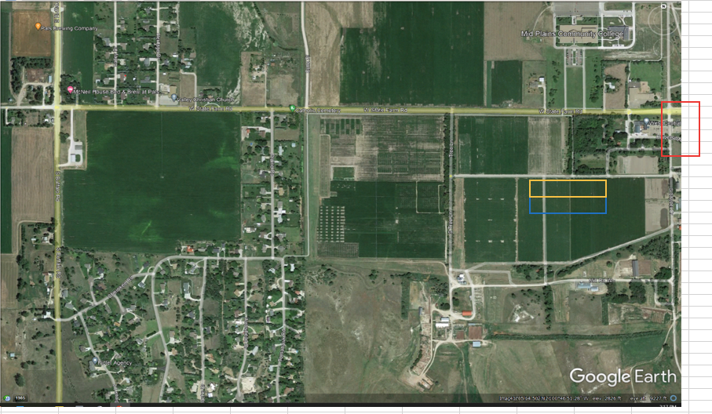
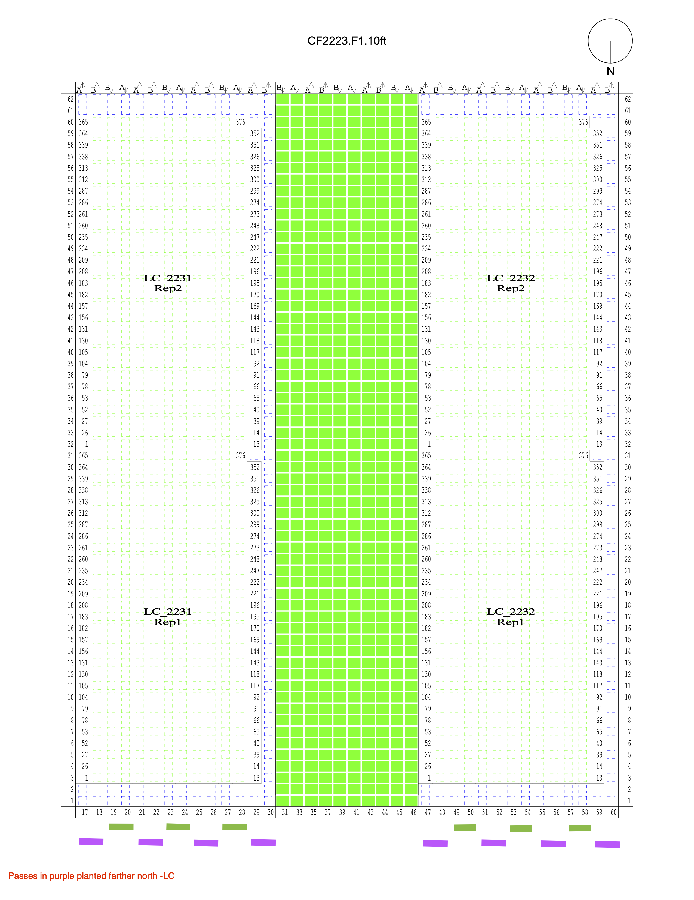
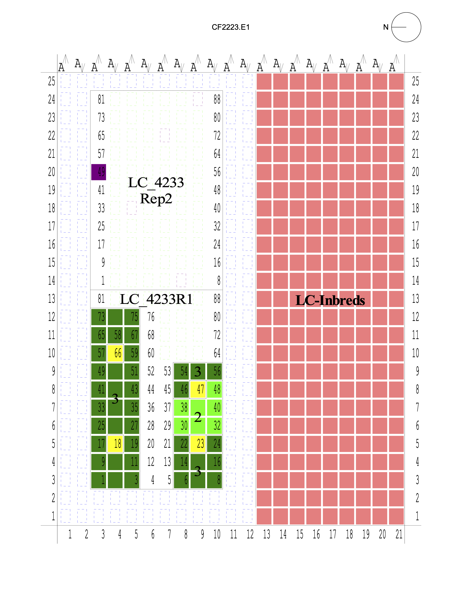

# HIPS README

This is the documentation for the HIPS 2022, 2023, & 2024 Dataset.

# Location Notes

## Lincoln 2022

The alley length in both the Inbred HIPS and Hybrid HIPS fields was 2.5
feet, and the distance between seeds in a row was 6 inches. Nitrogen
application was made on March 29, 2022 at the treatment-specified rates
(Low: 75 lbs/acre, Medium: 150 lbs/acre, High: 225 lbs/acre) with urea
ammonium nitrate (32-0-0) Conventional tillage was done prior to
planting.

### Inbred HIPS field

Plots in the Inbred HIPS field were 10 feet long center to center,
including 7.5 feet of plants and 2.5 feet of alley. The planting date
was May 5, 2022. Plots were hand-harvested (4 ears per plot) on October
8, 2022. The previous crop in the field was soybeans. The GPS
coordinates for the field corners were:

-   NE corner: 40°51'32.96"N, 96°35'50.40"W

-   SW corner: 40°51'31.39"N, 96°35'54.10"W

-   NW Corner: 40°51'32.93"N, 96°35'54.10"W

-   SE Corner: 40°51'31.44"N, 96°35'50.36"W

Plots were two-row plots, and the field contained 16 plots (160 feet)
north to south and 58 plots (290 feet) east to west.

### Hybrid HIPS field

Plots in the Hybrid HIPS field were 20 feet long center to center,
including 17.5 feet of plants and 2.5 feet of alley. The planting date
was May 22, 2022. Plots were hand-harvested (4 ears per plot) on October
1, 2022 and combine harvested on October 10, 2022. The previous crop in
the field was maize. The GPS coordinates for the field corners were:

-   NE corner: 40°51'8.59"N, 96°36'50.26"W

-   SW corner: 40°51'7.25"N, 96°37'0.54"W

-   NW Corner: 40°51'8.70"N, 96°37'0.52"W

-   SE Corner: 40°51'7.12"N, 96°36'50.29"W

The field was 150 feet north to south and 800 feet east to west.
Differential weed pressure existed throughout the field according to
James.

## Missouri Valley 2022

175 lbs of urea was applied on both the hybrid and inbred fields in this
location. The nitrogen fertilizer was applied on June 6, 2022. The field
latitude is 41.671747 N and the longitude is -95.943982 W. The fields
were not irrigated. Planting was completed on April 29, 2022 and the
harvest was completed on October 11, 2022. The previous crop for was
corn.

### Inbred HIPS field

There were 752 plots (376 plots per replication) in this field. The
plots were two-row plots. The plot numbers shown in the image correspond
to those used in the QR codes.

### Hybrid HIPS field

There were 176 plots (88 plots per replication) in this field. The plots
were four-row plots.

The plot numbers shown in the image correspond to those used in the QR
codes. The QR codes mis-assigned the replicate numbers. These have been
fixed in the dataset.

## North Platte 2022

Only the Hybrid HIPS population was grown at this location. Plot numbers
are unique across the North Platte location, but range and row numbers
were duplicated in each field. Each field is a different irrigation
treatment. To account for this, the location was split in 3 by
irrigation treatment in the data. North Platte1 is the full irrigation
field; North Platte2 is the partial irrigation field, and North Platte3
is the dryland, i.e. rainfed, field. The plots were 4-row, 20 foot
plots, with 17 feet of the plot planted and 3 feet of alley. Nitrogen
treatments were blocked within each irrigation treatment. The full
irrigation field was planted on May 17, 2022, and harvested on October
21, 2022 and November 1, 2022 with planted plot lengths of 17.5 feet.
The partial irrigation field was planted on May 17, 2022 and harvested
October 26 - 28, 2022 with planted plot lengths of 17.5 feet. The
dryland field was planted on May 18, 2022 and harvested on October 19-21
and 24, 2022 with planted plot lengths of 17 feet. The previous crop was
soybeans. Nitrogen was applied on June 16, 2022 as 32-0-0 with a 360 Y
drop applicator.

In the image above, the blue rectangle is the approximate location of
the full irrigation field, the yellow rectangle is the approximate
location of the partial irrigation field, and the red rectangle is the
approximate location of the dryland field.

The irrigation amounts and timing for the full and partial fields is as
follows:

## Scottsbluff 2022

The field was irrigated for one hour from 4:00 p.m. to 5:00 p.m. every
Friday evening, for a total of 16.86 inches of irrigation provided over
the growing season.. The row spacing was 30". In-field measurements
(flowering time, height data, and combine yield measurements) use the
range-row system defined in the sheet 'Layout (Original)' of the files
'Scottsbluff Hybrid HIPS - Summary.xlsx' and 'Scottsbluff Inbred HIPS -
Summary.xlsx'. In the data, these range-row assignments were dropped in
favor of using the range-row assignments listed in the QR codes and used
by the ear phenotype and NIR grain composition measurements, which
better capture the spatial distance between plots where there are border
plots. The geographic location within the field of a plot by its plot
number is the same in both layouts, but the range-row numbering is
different. The range-row system used in the QR codes and the data is
depicted in the sheet 'Layout (Modified)' of the files 'Scottsbluff
Hybrid HIPS - Summary' and 'Scottsbluff Inbred HIPS - Summary.xlsx', and
shown in the image below. 'Fill' is equivalent to 'Border' at other
locations. The field was planted north to south and together, the inbred
and hybrid fields are 625 feet north to south. The fields were planted
on May 19, 2022. A combination of 10-34-0 (NPK) liquid fertilizer and
urea were applied to meet the nitrogen treatment level requirements, as
shown below. Urea applications were made on July 8, 2022. Both field
layouts denote that planting of the hybrid plots started in the
southeast corner of the field; however, the correlations between two
replicates of a genotype within a treatment indicate that planting
started in the southwest corner of the field. The inbreds were still
located directly to the west of the hybrids. In the corrected layout,
plot 1001 is in the SW corner of the field, plot 1025 is in the NW
corner of the field, the NE corner of the field is a fill plot, and plot
1491 is in the SE corner of the field. The previous crop was dry beans.

### Inbred HIPS field

The plots were 10 foot (7.5 feet planted), 2-row plots. This field was
very weedy according to Ramesh.

### Hybrid HIPS field

Based on yield data and grain protein content, it was determined that
the labels in the QR codes for the high and low nitrogen treatments were
reversed. The QR codes in the data reflect the content of the original
QR codes, and the nitrogen treatment variable reflects the actual level
of nitrogen the plot received. The plots were 25 foot (22.5 feet
planted), 4-row plots and the middle two rows were harvested.

## Crawfordsville 2022

These fields were planted on May 11, 2022 and harvested on October 7,
2022. Both the inbred and hybrid fields had 3 nitrogen treatments (High,
Medium, and Low). The field coordinates were 41.199066, -91.486991. The
nitrogen treatments were applied on June 2, 2022 using 32% UAN.

### Field A - Low and High Nitrogen

Low nitrogen is to the west in these maps. The previous crop was
soybeans.

### Field B - Medium Nitrogen

The previous crop was soybeans.

.png)

-Inbreds_offset_markup.png)

## Ames 2022

These fields were planted on May 23, 2022 and harvested on October 16,
2022. Both the inbred and hybrid fields had 3 nitrogen treatments (High,
Medium, and Low). The High and Medium nitrogen treatments for both
hybrids and inbreds were located in the B1 field. The Low nitrogen
treatments for both hybrids and inbreds were located in the E1 field.

### B1

This field was planted on May 22, 2022. Nitrogen was applied using urea
and 32% UAN on May 17, 2022, and June 1, 2022. The field coordinates
were 42.015354, -93.732519. The previous crop was corn.

### E1

This field was planted on May 23, 2022. Nitrogen was applied using urea
on May 21, 2022. The field coordinates were 42.012376, -93.737301. The
previous crop was soybeans.

## North Platte 2023

Plots were 4 row plots with 30" row spacing and were 20 feet center to
center, including 17.5 feet of plants and 2.5 feet of alley. Nitrogen
was applied on 6/15/23, 150 lb/a N as 32-0-0 surface applied with Y-Drop
applicator. The previous crop was was soybean. The field had 8
underground irrigation zones randomized within each of 4 blocks. 5 of
the zones were set to irrigate with 4.5 inches of irrigation over the
growing season, and 3 of the zones applied 0 inches of irrigation. The
field coordinates were 41.086705°, -100.775034° and plots were planted
on May 10, 2023. Hand harvesting was done on October 11, 2023, and
mechanical harvest was done on October 19, 2023.

There was significant hail damage the night of July 22-23, during the
middle of the tasseling period.

## Lincoln 2023

All plots had 30 inch row spacing and 2.5 ft alleys. The field
coordinates were 40.859683°, -96.596310°. The previous crop was
soybeans.

### Hybrid HIPS field

The field was planted on May 16, 2023. 3 rates of nitrogen (75, 150, and
225 lbs/acre) were applied as liquid urea. Plots were 4-row plots, 20
feet center to center. Hand harvest was completed on September 25, 2023
and mechanical harvesting was done on October 23, 2023.

### Inbred HIPS field

The field was planted on May 9, 2023. A single rate of nitrogen (150
lbs/acre) was applied as liquid urea. Plots were 2-row plots. Hand
harvest was completed on September 30, 2023. Plots were 10 feet center
to center with 2.5 ft alleys.

## Missouri Valley 2023

The field coordinates were 41.671045°, -95.945240°. The row spacing was
30" and the previous crop was soybean. A single nitrogen rate (160
lbs/acre) was applied with NH3. Both inbred and hybrid fields were
planted May 2, 2023. Hand harvest for both fields was completed on
September 17, 2023.

### Hybrid HIPS field

Plots were 20 feet center to center, with 2.5 ft alleys, and 4 rows.
Mechanical harvest was completed on September 25, 2023.

### Inbred HIPS field

Plots were 10 feet center to center, with 2.5 ft alleys, and 2 rows.

## Ames 2023

The field coordinates were 42.014654°, -93.728797°. The previous crop
was soybeans. Both inbreds and hybrids were planted on May 19, 2023. 3
rates of nitrogen (75, 150 and 225 lbs/acre) were applied with 32% UAN.
Row spacing was 30". In the map, hybrids are located between the sets of
inbreds.

### Hybrid HIPS field

Plots were 4 row plots, 20 feet center to center with 2.5 ft alleys.
Hand harvest was completed on October 15, 2023. Mechanical harvest was
completed on October 19, 2023.

### Inbred HIPS field

Plots were 2 row plots, 10 feet center to center with 2.5 ft alleys.
Hand harvest was completed between October 17 and November 16, 2023.

## Crawfordsville 2023

The field coordinates were 41.194394°, -91.478950°. The previous crop
was soybeans. Both inbreds and hybrids were planted on May 4, 2023. 3
rates of nitrogen (75, 150 and 225 lbs/acre) were applied with 32% UAN.
Row spacing was 30". In the map, hybrids are located between the sets of
inbreds.

### Hybrid HIPS field

Plots were 4 row plots, 20 feet center to center with 2.5 ft alleys.
Hand harvest was completed on between September 29 and October 1, 2023.
Mechanical harvest was completed on October 2, 2023.

### Inbred HIPS field

Plots were 2 row plots, 10 feet center to center with 2.5 ft alleys.
Hand harvest was completed on between September 29 and October 1, 2023.

## Lincoln 2024

**Location:** University of Nebraska-Lincoln Havelock Research Farm\
Field Block 2-15 Latitude: 40.863628 Longitude: -96.600976

**Field Design:** Seed was generated, packaged, and supplied by Lisa
Coffey at ISU
([lmcoffey\@iastate.edu](mailto:lmcoffey@iastate.edu){.email}) 4 total
blocks (replications), 2 N+ and 2 N- N- Blocks - No supplemental
nitrogen applied N+ Blocks - 150 lbs/acre of N applied 128 experimental
plots/block (127 genotypes + 1 extra rep of [Std Q60 x M441D] as a
planting check Four-row plots 30" row spacing 21 feet (center of alley
to center of alley), 18 feet 6 inches (planted length)

**Planting/Germination/Harvest Issues:**\
Planting: GPS disconnection caused a shift in Row 51 Ranges 1-10 towards
the front of the field, Gap at Row 51, Range 10, filled with commercial
seed, last experimental plot (originally Row 51, Range 2) in Range 1
(Border) Germination: 10 Plots with little/no germination: 1031, 1122,
1163, 1183, 1203,1238, 2064, 2094, 2216, 2255 Germination: 1 Plot - left
two row did not germinate but right looked good: 2038 Harvest: Plots
2158 and 2163 combined together (mixed) during harvest, Yield data
discarded

**Field Management:** Corn/Soybean crop rotation - soybeans in 2023
4/8/24 - 150 lbs/acre of liquid urea applied to N+ blocks 5/8/24 - 64 fl
oz/acre Acuron + 32 fl oz/acre Liberty applied 5/15/24 - Field Planted
6/7/24 - Low/no germination plots filled with commercial hybrid seed
(P1185AM) 6/10/24 - 48 fl oz/acre Acuron + NIS applied 6/18/24 -
6/20/24 - Field hand-weeded, canopy formed shortly after, no further
weed issues 9/26/24 - Field Harvested UNL Farms (Josh Reznicek) with
2-row plot combine

**Data Collection:**\
6/28/24 and 6/30/24 - Stand Count: Recorded hand-counts of the number of
plants in the middle two rows of a plot in FieldBook 7/7/24 to 8/2/24 -
Male Flowering: Recorded the date the plot reached the half-bloom stage
(50% of plants have anthers emerging) in FieldBook 7/8/24 to 8/2/24 -
Female Flowering: Recorded the date the plot reached the half-bloom
stage (50% of plants have silks emerging) in FieldBook 7/31/24 -
Chlorophyll Concentration: Collected using Apogee MC-100 Chlorophyll
Concetration Meter, Fourth leaf from the top of the plant measured (flag
leaf is 1st leaf) at roughly the midpoint of leaf (long) and the
midpoint between midrib and leaf edge, Recorded the average of 3 plants
per in FieldBook, Measured in absolute units [µmol m-2] 9/20/24 and
9/24/24 - Ear Height: Recorded the height of the ear of three plants per
plot in FieldBook, Measured in feet using a ruled scale, Average of the
three values calculated during data processing 9/20/24 and 9/24/24 -
Plant Height: Recorded the height of three plants per plot in FieldBook,
Measured from the ground to the tip of the tassel in feet using a ruled
scale, Average of the three values calculated during data processing
9/20/24 and 9/24/24 - Lodging Percentage: If plots appear significantly
lodged to the point of affecting combine data (\>50% lodged), the
lodging percentage was visually estimated and recorded in FieldBook. If
the plots were only slightly lodged, "Stem Lodged" counts were divided
by "Stand Count" to calculated a lodging percentage 9/20/24 and
9/24/24 - Stem Lodged: If plots had partial lodging (less than 50%),
stem lodged plants in the middle two rows were counted and recorded,
Stem lodging was defined as plants broken below the primary ear
9/26/24 - Yield: The middle two rows of each plot were harvested using a
Zurn 160 Plot Combine by Josh Reznicek, Weight, Moisture, and Test
Weight data was recorded by the combine software (Harvest Master's Mirus
Data Collection software, Yield was calculated from weight and moisture
(plots weights adjusted to a standarized 15.5% moisture, divided by plot
area (92.5ft2) and divided by 43560 to get lbs/acre, divided by 56 to
get Bushels/acre

**Weather Station:** 6/5/24 - Weather station installed 6/5/24 to
6/27/24 - Wind direction vane not properly calibrated, wind direction
during this time period is innacurate, DISCARDED 6/7/24 to 6/27/24 -
Wind speed fan removed to replacing missing fan on Clearwater unit. Wind
speed during this time period is innaccurate, DISCARDED

**Severe Weather Events:** 7/1/24 to 7/2/24 - Significant wind/rainfall
event; Weather station showed a 24 hour precipitation total of 1.89" at
9am on 7/1/24, Weather station showed a 24 hour precipitation total of
6.26" at 7am on 7/2/24, Reports of 5"+ in Havelock during the
night/early morning of 7/2/24 alone, Field flooded, flood damage
occurred in low-lying plots, Water damaged plots indicated in the plot
notes, Some lodging but largely recovered 7/31/24 - Significant
wind/rain event, Weather Station showed a 24 hour precipitation total of
1.92" at 10am on 8/1/24, Reports of 75-90 mph winds, Significant lodging
occurred and was noted in FieldBook

**Other/Misc.** Planting issue in Border rows (67 and 68) due to
micommunication. Row 68 Ranges 19 and 20, and Row 67 Rang 20 were empty
and filled with B104 inbred seed. This did not affect the experiemntal
design Accuron should be applied at the optimal time to achieve desired
weed control. The optimal time would be as weed seedling emerge and at
appropriate soil moisture (4-5 days after rain) Low-yielding plots did
not have enough grain (Minimum 4lbs) to measure moisture/test weight.
These values were reported as 0s in the combine data and were replaced
with NAs to avoid confusion

## Clearwater 2024

**Location:** Apex Custom Research Enterprises (A.C.R.E.)
([nick\@apexcustomresearchenterprises.com](mailto:nick@apexcustomresearchenterprises.com){.email})
Clearwater, Nebraska Latitude: 42.204116 Longitude: - -98.246518

**Field Design:** Seed was generated, packaged, and supplied by Lisa
Coffey at ISU
([lmcoffey\@iastate.edu](mailto:lmcoffey@iastate.edu){.email}) 2 total
blocks (replications) 128 experimental plots/block (127 genotypes + 1
extra rep of [Std Q60 x M441D] as a check) Four-row plots 30" row
spacing 20 feet (center of alley to center of alley), 17 feet (planted
length) Managed tp popcorn production standards, Pesticide, fertilizer,
and irrigation outlined below

**Planting Issues:** Planting error in Row 17 Range 13, missed planting,
gap at Row 17 Range 13, Plots shifted towards front of the field, last
experimental plot (originally Row 17 Range 2) now in Range 1 (Border) 6
Plots with little/no germination: 5032, 5030, 5077, 6016, 6092, 6103

**Field Management:** Soybeans planted in 2023, Rye cover crop prior to
2024 season Total fertilizer application (lb/acre): N-P-K = 254-76-83
4/2/24 - Dry fertilizer application: 102.4 lbs/acre Potash (0-0-60, 61
lbs/acre K), 116.9 lbs/acre MESZ (12-40-0-10S-1ZN, 14 lb/acre N, 46
lb/acre P, 11.7 lb/acre S, 1.2 lb/acre ZN), 37.9 lb/acre KMAG
(0-0-21.5-21.5-10.5, 8 lb/acre K, 8 lb/acre Mg, 4 lb/acre S) 4/20/14 -
Burndown herbicide and N application: 16 oz/acre 2-4D LV6 AS 2.5G, 40
oz/acre Roundup Powermax 3, 51 lb/acre ammonium sulfate (21-0-0-24S, 11
lb/acre N, 12.2 lb/acre S) 5/3/24 - Field planted and dry fertilizer
application: 24.8 lb/acre Potashh (0-0-60, 14 lb/acre K), 59.4 lb/acre
MESZ (12-40-0-10S-1ZN, 9 lb/acre N, 30 lb/acre P, 7.5 lb/acre S, 0.75
lb/acre ZN) 5/18/24 - Herbicide and fertilizer application: 16 oz/acre
2-4D LV6 AS 2.5G, 4 oz/acre Arctic 3.2EC MB, 1 lb/acre, Harness Extra
6.0 Bulk, 20 gal/acre Liquid N (32-0-0, 59.4 lb/acre N), 2.6 gal/acre
Thiosulfate (12-0-0-26S, 3 lb/acre N, 6.5 lb/acre S), 6/12/24 -
Herbicide and fertilizer application: 1.8 oz/acre Accent Q, 1.5 lb/acre
Atrazine 90DF Winfield, 3 oz/acre Laudis, 51 lb/acre ammonium sulfate
(21-0-0-24S, 11 lb/acre N, 12.2 lb/acre S) 6/18/24 - Field cultivated,
fertigation: 10.6 gal/acre Advancedf Liquid N (28-0-0-5S, 32.2 lb/acre
N, 5.8 lb/acre S) 6/28/2024 - Fertigation: 11.4 gal/acre Advancedf
Liquid N (28-0-0-5S, 34.2 lb/acre N, 6.1 lb/acre S) 7/11/2024 -
Fertigation: 11.3 gal/acre Advancedf Liquid N (28-0-0-5S, 33.8 lb/acre
N, 6 lb/acre S) 7/16/2024 - Fertigation: 10.6 gal/acre Advancedf Liquid
N (28-0-0-5S, 31.7 lb/acre N, 5.7 lb/acre S) 8/8/2024 - Fertigation: 4.9
gal/acre Advancedf Liquid N (28-0-0-5S, 14.6 lb/acre N, 2.6 lb/acre S)
10/9/24 and 10/10/24 - Harvested

**Irrigation:** Approximately 16" of supplemental irrigation from
July-September (\~1.5" per week), Center-pivot irrigation system

**Data Collection:**\
Populations: Recorded the number of plants in the middle two rows of the
plot, dived that number by 2 to get an average stand per row, and this
multiplied this value by 1000 (1 row is \~1/1000 acre) to get
populations in plants/acre Standability and Std %: Visually rated plots
from 0-10 - SEE SCALE BELOW), The std% is the square of the standability
rating, 0 = no lodging (all plants standing), 2 = 4% lodged, 3 = 9%
lodged, 4 = 16% lodged, 5 = 25% lodged, 6 = 36% lodged, 7 = 49% lodged,
8 = 64% lodged, 9 = 81% lodged, 10 = 100% lodged (all plants
lodged/broken/on ground) 7/8/24 to 7/23/24 - Male Flowering: Recored the
date the plot reached the half-bloom stage (50% of plants have anthers
emerging) 7/10/24 to 7/24/24 - Female Flowering: Recorded the date the
plot reached the half-bloom stage (50% of plants have silks emerging)
10/9/24 to 10/10/24 - Yield: The middle two rows of each plot were
harvested with a plot combine by Nick Hoffman of A.C.R.E., Weight,
Moisture and yield data was recorded by the combine software

**Weather Station:** 6/10/24 - Weather station installed

**Severe Weather Events:** One small wind event which did not do much
damage, some corn borer pressure but not excessive

**Other/Misc.:** Wildlife (raccoons) predated certain plots, damaging
plants, removing ears and reducing yield. These plots are indicated with
a "wildlife damage" note in the Notes column, Damage was first noticed
after flowering, Nick Hoffman orignally thought the damage was limited
to 1-2 hybrids in both reps, Damage ended up being more extensive with
Nick observing more damage to "white multicolered hybrids", Trial was
surrounded by popcorn, Raccoons appeared to much prefer field corn,
Particulary palatable hybrids targeted. Some plots were nearly 100%
damaged while adjacent plots appeared untouched; Nick describes the
trial's proximity to a riparian area as a contributing factor. He was
unsure of the best method of controlling raccoons or what level of
damage warranted further action and none was taken. Nick was
disappoitned by this and did not forsee this issue as this was his first
year with the business/field. Minor corn borer pressure, not excessive

# Additional Data Available

Upon request, the following data is available:

<!-- # Data Generation and Processing Notes -->

<!-- The following may be helpful in case of questions: -->

<!-- Jon Turkus generated the Excel file 'Summary of Lincoln Hybrid HIPS 2022 -->

<!-- Data.xlsx' and collected the agronomic metadata for Lincoln. -->

<!-- Collection of NIR measurements were led by Chidanand Ullagaddi. -->

<!-- Collection of ear phenotypes post-harvest for the Scottsbluff, North -->

<!-- Platte, Lincoln, and Missouri Valley locations was led by Lina López. -->

<!-- All data for the Ames and Crawfordsville were collected by the ISU -->

<!-- Schnable Lab and/or the yield trial provider. Plant height data for -->

<!-- Missouri Valley was collected by Huyu Liu and undergraduate students -->

<!-- from the ISU Schnable Lab. -->

<!-- Ramesh Kanna provided in-field measurements and agronomic data for the -->

<!-- Scottsbluff location. -->

<!-- NIR data was cleaned and processed by James Schnable using the script -->

<!-- 'clean_combineNIR.py'. -->

<!-- Ear data was cleaned and summarized to a plot level by James Schnable -->

<!-- using the script 'parseears.py'. -->

<!-- Subsequently, all data was combined and cleaned by Jensina using the -->

<!-- script 'CombineHIPS22Data.R'. -->

\newpage

# Appendix

## Documentation for Additional Data Available

### Leaf Length

This is the length in centimeters of the ear leaf from the stalk to leaf
tip of one plant from the plot. It is abbreviated as **'leaf_len1'**.
This information for the Lincoln location was taken from the sheet
'Combined Dataset' in the file 'Summary of Lincoln Hybrid HIPS 2022
Data.xlsx'.

### Leaf Width

This is the width in centimeters of the midpoint of the ear leaf of one
plant from the plot. It is abbreviated as **'leafWidth1'**. This
information for the Lincoln location was taken from the sheet 'Combined
Dataset' in the file 'Summary of Lincoln Hybrid HIPS 2022 Data.xlsx'.

### Ear

This is the order the ears were phenotyped. It is abbreviated in the
code as 'earNum', but does not appear in the final dataset as the ear
data was transformed to have four columns each for ear width, kernel
fill length, kernel row number, kernels per row, ear weight, seed color,
total kernel count, cob length, cob width, cob weight, and 100 kernel
weight. These variables with the suffix '1' correspond to ears with an
ear number of 1 in the dataset, and this convention is maintained for
the variable suffixes 2-4. All ears with an ear number greater than 4
were dropped to create a balanced dataset.

### Ear Weight

This is the weight of one ear from the plot in grams prior to shelling
(i.e. with the kernels attached to the cob). This corresponds to the ear
with an ear number of 1 from the original dataset. It is abbreviated as
**'earWt1'**. This information for Lincoln hybrids, Missouri Valley
hybrids and inbreds, and some of the North Platte location, was taken
from the file '2022_Hybrid HIPS - Post Harvest Data - Prototype
File.csv'. Information for the remaining ears from North Platte and the
Scottsbluff hybrids were taken from the file 'NP-SB_2022'.

### Ear Drop Number

This is the number of ears that fell to the ground in the middle two
rows of the plot for hybrids. It is abbreviated as **'earDropNum'**.
This information for North Platte was taken from the sheets 'No Irr
Data', 'Reduced Irr Data', and 'Full Data' in the file
'2022_Schnable_HIPS_data_v4.xlsx'.

### Stand Count 1

This is the number of standing plants in one row of the plot. It is
abbreviated as **'standCt1'**. This information for Missouri Valley was
taken from the sheets 'RawData (4-Row)' and 'RawData (2-Row)' for
hybrids and inbreds, respectively, in the file
'YTMC_Lisa_Plot_Coordinates_v4.xlsx'. This information for North Platte
was taken from the sheets 'No Irr Data', 'Reduced Irr Data', and 'Full
Data' in the file '2022_Schnable_HIPS_data_v4.xlsx'.

### Stand Count 2

This is the number of standing plants in a second row of the plot. It is
abbreviated as **'standCt2'**. This information for Missouri Valley was
taken from the sheets 'RawData (4-Row)' and 'RawData (2-Row)' for
hybrids and inbreds, respectively, in the file
'YTMC_Lisa_Plot_Coordinates_v4.xlsx'. This information for North Platte
was taken from the sheets 'No Irr Data', 'Reduced Irr Data', and 'Full
Data' in the file '2022_Schnable_HIPS_data_v4.xlsx'.

### Historical Flowering Time

This is the historical flowering time, in days, of the inbred and was
used to for blocking the inbreds. It is abbreviated as **'histFT'**.
This information was taken from the sheet 'RawData (2-Row)' in the file
'YTMC_Lisa_Plot_Coordinates_v4.xlsx'.

### Historical Plant Height

This is the historical plant height, in centimeters, of the inbred, and
was used for blocking the inbreds. It is abbreviated as
**'histPlantHt'**. This information was taken from the sheet 'RawData
(2-Row)' in the file 'YTMC_Lisa_Plot_Coordinates_v4.xlsx'.

### Inbred Block

This is the block the inbred was placed in based on historical plant
height and days to flowering. It is abbreviated as **'block'**. This
information was taken from the sheet 'RawData (2-Row)' in the file
'YTMC_Lisa_Plot_Coordinates_v4.xlsx'.

### Population

This is the genotypic population the plants grown in the plot are from,
either the Hybrid HIPS population, abbreviated as 'Hybrid', or the
Inbred HIPS population, also known as the SAM population, abbreviated as
'Inbred'. It is abbreviated as **'population'**.

### Ear Length - Pre-Shelling

This is the mean length of the ear prior to shelling (i.e. with the
kernels on the ear) of one ear from the plot. It is abbreviated as
**'earLen'**. This information for the Ames and Crawfordsville locations
was taken from the files in the folder '3 Ear Traits Station' and
converted from millimeters to centimeters. For these two locations, when
the ear had severe bending, a string was used to measure the length and
this is denoted in the notes field. This data was not collected at the
North Platte, Scottsbluff, Lincoln, and Missouri Valley locations.

### Tassel Tip Height

This is the height in centimeters of the plant, including the tassel, of
one plant from the plot (in the case of Scottsbluff) or the average of
this measurement for two plants from the plot in Lincoln. All
measurements from plants noted as stunted or without a silk were marked
as missing data prior to calculation. It is abbreviated as
**'tasselTipHt'**. This information for the Lincoln location hybrids was
taken from the sheet 'Combined Dataset' in the file 'Summary of Lincoln
Hybrid HIPS 2022 Data.xlsx'. For Scottsbluff hybrids, this data was
taken from the sheet 'Hybrid_height data' from the file
'Corn_data_Scottsbluff-2022_rk_11.11.2022' and converted from inches.
Plot 1322 at the Scottsbluff location was dropped due to having a value
more than 114 centimeters (roughly 3.7 feet) greater than all other
observations.

### KernelStriping

This is whether or not the kernels from the plot exhibited striping. It
is abbreviated as **'kernelStriping'**. This information for hybrids and
Missouri Valley inbreds was taken from the file
'plotleveleardata_v2.csv'. This information was not collected for the
Ames and Crawfordsville locations.

### Percent Shoot Lodge

This is the percent of plants that lodged due to stalk breakage in the
middle two rows of the plot for hybrids and in the whole plot for
inbreds. It is abbreviated as **'pctStalkLodge'**. This information for
Missouri Valley, Crawfordsville, and Ames was taken from the sheets
'RawData (4-Row)' and 'RawData (2-Row)' for hybrids and inbreds,
respectively, in the file 'YTMC_Lisa_Plot_Coordinates_v4.xlsx'. This
information for North Platte was taken from the sheets 'No Irr Data',
'Reduced Irr Data', and 'Full Data' in the file
'2022_Schnable_HIPS_data_v4.xlsx'.

### Percent Root Lodge

This is the percent of plants that lodged due to insufficient roots in
the middle two rows of the plot for hybrids and in the whole plot for
inbreds. It is abbreviated as **'pctStalkLodge'**. This information for
Missouri Valley, Crawfordsville, and Ames was taken from the sheets
'RawData (4-Row)' and 'RawData (2-Row)' for hybrids and inbreds,
respectively, in the file 'YTMC_Lisa_Plot_Coordinates_v4.xlsx'. This
information for North Platte was taken from the sheets 'No Irr Data',
'Reduced Irr Data', and 'Full Data' in the file
'2022_Schnable_HIPS_data_v4.xlsx'.

### latitude

This is the latitude of the plot. This information for Missouri Valley,
Crawfordsville, and Ames was taken from the sheets 'RawData (4-Row)' and
'RawData (2-Row)' for hybrids and inbreds, respectively, in the file
'YTMC_Lisa_Plot_Coordinates_v4.xlsx'.

### longitude

This is the longitude of the plot. This information for Missouri Valley,
Crawfordsville, and Ames was taken from the sheets 'RawData (4-Row)' and
'RawData (2-Row)' for hybrids and inbreds, respectively, in the file
'YTMC_Lisa_Plot_Coordinates_v4.xlsx'.

### 
