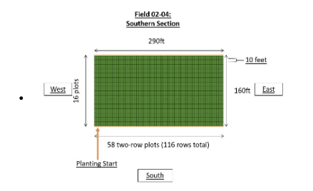
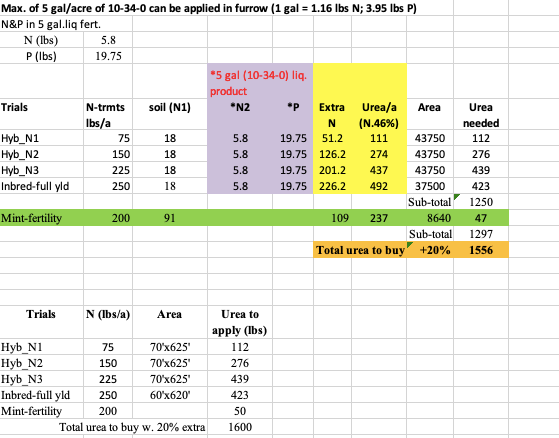
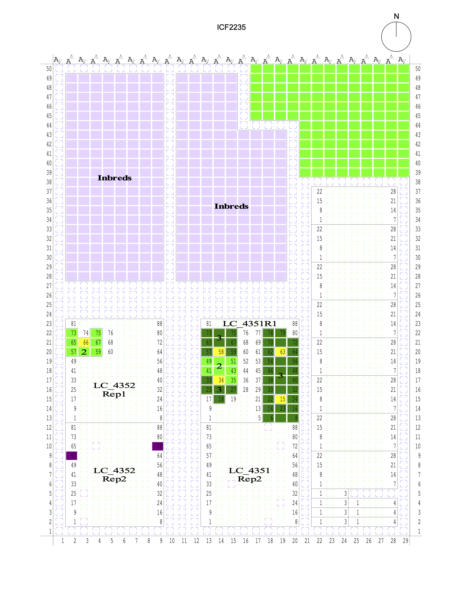
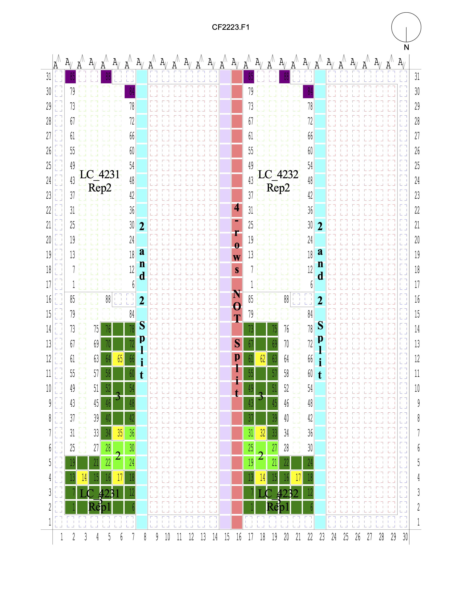
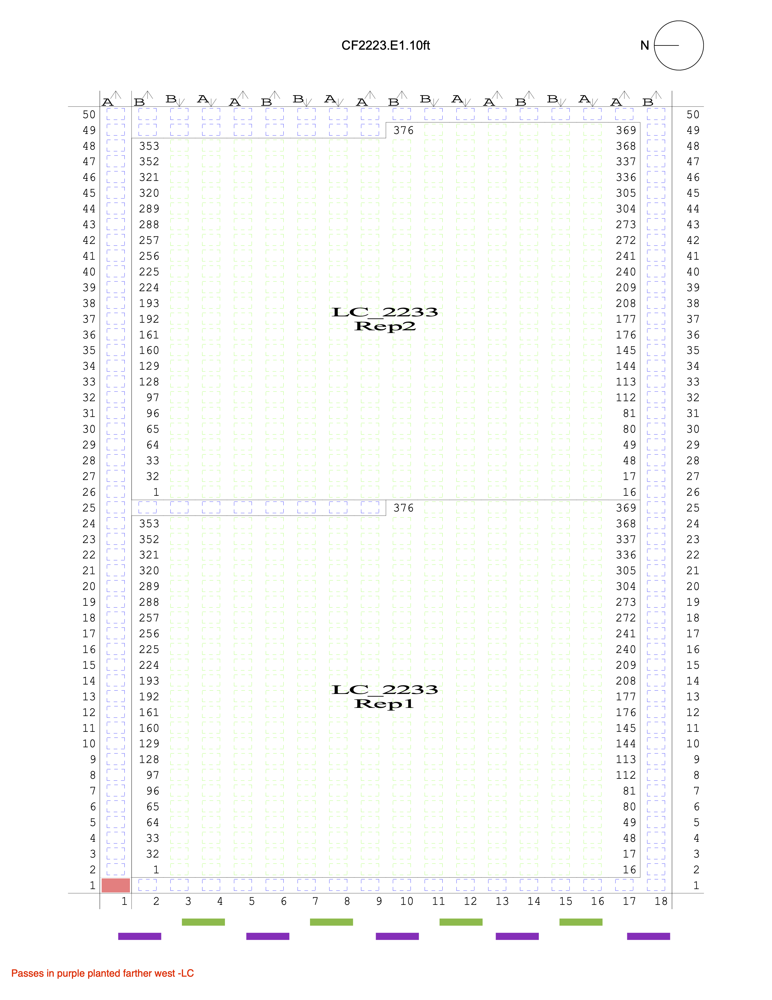

```{r setup, include=FALSE}
knitr::opts_chunk$set(echo = TRUE)
```

This is the documentation for the HIPS 2022 Dataset.

# Variable Definitions And Notes

Each of the following variables includes notes on how the trait was
collected and the original data file the data was taken from and any
specific notes regarding errors or data cleaning done. Variables are
listed by the name used in the final version of the data set. For all
quantitative variables, observations an order of magnitude larger than
other observations, those appearing as extreme outliers in histograms,
and those appearing outside the primary bounds of the distribution for
the location were dropped from the data set.

### qrCode

This is the QR code assigned to the plot. This information for the
Lincoln location hybrids was taken from the sheet 'Combined Dataset' in
the file 'Summary of Lincoln Hybrid HIPS 2022 Data.xlsx'. This
information for hybrids in the Scottsbluff, Missouri Valley, and North
Platte locations was taken from the file
'HybridHIPS_plotlevelNIR\$\_v2.6.csv'. This information for the Ames and
Crawfordsville locations was taken from the unique id field in the
sheets 'RawData (4-Row)' and 'RawData (2-Row)' in the file
'YTMC_Lisa_Plot_Coordinates_v4.xlsx'.

### location

This is the location the plot was grown in. In the case of North Platte
is treated as 3 separate locations to account for the duplication of
range and row numbers across the different irrigation levels, and so
that irrigation was not nested within this location, similar to the
other locations. This information for the Lincoln location hybrids was
taken from the sheet 'Combined Dataset' in the file 'Summary of Lincoln
Hybrid HIPS 2022 Data.xlsx'. This information for the hybrids in the
Scottsbluff, Missouri Valley, and North Platte locations was taken from
the file 'HybridHIPS_plotlevelNIR\$\_v2.6.csv'. This information for the
Ames and Crawfordsville locations was taken from the unique id field in
the sheets 'RawData (4-Row)' and 'RawData (2-Row)' in the file
'YTMC_Lisa_Plot_Coordinates_v4.xlsx' and uses the letter contained in
the QR.

### sublocation

This is the field within the location the plot was grown in. This
information for the Lincoln location hybrids was taken from the sheet
'Combined Dataset' in the file 'Summary of Lincoln Hybrid HIPS 2022
Data.xlsx'. This information for the hybrids in the Scottsbluff,
Missouri Valley, and North Platte locations was taken from the file
'HybridHIPS_plotlevelNIR\$\_v2.6.csv'. This is information for the Ames
and Crawfordsville locations was determined based on experiment code,
which was dependent on the nitrogen level and the field maps.

### irrigationProvided

This is the total amount of water in inches provided to the plot via
irrigation over the course of the growing season. This information for
the Lincoln location hybrids was taken from the sheet 'Combined Dataset'
in the file 'Summary of Lincoln Hybrid HIPS 2022 Data.xlsx'. This
information for the North Platte location was taken from the files
'HybridHIPS_plotlevelNIR\$\_v2.6.csv' and
'weather/2022_HIPS_Irrigation_North_Platte.xlsx' and from personal
communications for Missouri Valley and Scottsbluff locations.

### nitrogenTreatment

This is the categorical level of nitrogen fertilizer the plot was
supplied with. Plots denoted as 'Low' received a rate of 75 lbs/acre.
Plots denoted as 'Medium' received a rate of 150 lbs/acre, except at
Missouri Valley, where the 'Medium' nitrogen treatment received a rate
of 175 lbs/acre. Plots denoted as 'High' received a rate of 225
lbs/acre, except in Ames, where plots in the 'High' treatment received
250 lbs/acre. In Scottsbluff, based on the yield and grain protein
content data, the labels in the plot maps and the QR codes for high and
low nitrogen treatments were flipped. The QR codes are as originally
scanned, and this field reflects the correction of this error. This
information for the Lincoln location hybrids was taken from the sheet
'Combined Dataset' in the file 'Summary of Lincoln Hybrid HIPS 2022
Data.xlsx'. This information for the hybrids in the Scottsbluff,
Missouri Valley, and North Platte locations was taken from the file
'HybridHIPS_plotlevelNIR\$\_v2.6.csv'. This is information for the Ames
and Crawfordsville locations was determined based on experiment code,
which was dependent on the nitrogen level.

### poundsOfNitrogenPerAcre

This is the rate of nitrogen fertilization the plot received, in pounds
per acre. This information for each plot was based on the data
documentation for each field and the `nitrogenTreatment` and `location`
the plot belongs to.

### experiment

This is the experiment code the plot belonged to, corresponding to
nitrogen levels within a population (i.e. hybrid or inbred) within a
location for the Missouri Valley, Ames, and Crawfordsville locations.
This information was taken from the 'Basic info' sheet in the file
'YTMC_Lisa_Plot_Coordinates_v4.xlsx'. Experiment codes were not assigned
to Lincoln, North Platte, and Scottsbluff locations.

### plotLength

This is the planted length of the plot in feet. This information for
North Platte was taken from the sheets 'No Irr Data', 'Reduced Irr
Data', and 'Full Data' in the file '2022_Schnable_HIPS_data_v4.xlsx'.
This information for the Lincoln location was taken from personal
communications with Jon Turkus. This information for Missouri Vallley,
Scottsbluff, Ames, and Crawfordsville was taken from personal
communications with Lisa Coffey.

### totalStandCount

This is the number of standing plants in two rows. In the case of
hybrids, this is the middle two rows of the four-row plot, and in the
case of inbreds, both rows of the two-row plot. This information
('Stand') for Missouri Valley, Crawfordsville, and Ames was taken from
the sheets 'RawData (4-Row)' and 'RawData (2-Row)' for hybrids and
inbreds, respectively, in the file 'YTMC_Lisa_Plot_Coordinates_v4.xlsx'.
This information for North Platte was taken from the sheets 'No Irr
Data', 'Reduced Irr Data', and 'Full Data' in the file
'2022_Schnable_HIPS_data_v4.xlsx' as the sum of the columns 'R1 Stand'
and 'R2 Stand'. This data was not collected for the hybrid field at
Lincoln.

### block

This is the block number of the plot within a sublocation. These values
were assigned based on the location, sublocation, and rep number [not
included] associated with a plot. This information for the Lincoln
location hybrids was taken from the sheet 'Combined Dataset' in the file
'Summary of Lincoln Hybrid HIPS 2022 Data.xlsx'. This information for
the hybrids in the Scottsbluff, Missouri Valley, and North Platte
locations was taken from the file 'HybridHIPS_plotlevelNIR\$\_v2.6.csv'.
This information for the Missouri Valley, Ames, and Crawfordsville
locations was taken from the sheets 'RawData (4-Row)' and 'RawData
(2-Row)' in the file 'YTMC_Lisa_Plot_Coordinates_v4.xlsx'. The rep
numbers were misassigned in the QR codes used for ear phenotypes and NIR
measurements for the Missouri Valley hybrids, and have been corrected in
the block column in the dataset.

### row

This is the row number within a `sublocation` the plot was located in.
This information for the Lincoln location hybrids was taken from the
sheet 'Combined Dataset' in the file 'Summary of Lincoln Hybrid HIPS
2022 Data.xlsx'. This information for hybrids in the Scottsbluff,
Missouri Valley, and North Platte locations was taken from the file
'HybridHIPS_plotlevelNIR\$\_v2.6.csv'. This information for the Ames and
Crawfordsville locations was taken from the sheets 'RawData (4-Row)' and
'RawData (2-Row)' in the file 'YTMC_Lisa_Plot_Coordinates_v4.xlsx'. In
some files, this is denoted as 'Pass'.

### range

This is the range number within a `sublocation` the plot was located in.
This information for the Lincoln location hybrids was taken from the
sheet 'Combined Dataset' in the file 'Summary of Lincoln Hybrid HIPS
2022 Data.xlsx'. This information for the hybrids in the Scottsbluff,
Missouri Valley, and North Platte locations was taken from the file
'HybridHIPS_plotlevelNIR\$\_v2.6.csv'. This information for the Ames and
Crawfordsville locations was taken from the sheets 'RawData (4-Row)' and
'RawData (2-Row)' in the file 'YTMC_Lisa_Plot_Coordinates_v4.xlsx'.

### plotNumber

This is the number assigned to the plot. This information for the
Lincoln location hybrids was taken from the sheet 'Combined Dataset' in
the file 'Summary of Lincoln Hybrid HIPS 2022 Data.xlsx'.This
information for hybrids in the Scottsbluff, Missouri Valley, and North
Platte locations was taken from the file
'HybridHIPS_plotlevelNIR\$\_v2.6.csv'. This information for the Ames and
Crawfordsville locations was taken from the unique id field in the
sheets 'RawData (4-Row)' and 'RawData (2-Row)' in the file
'YTMC_Lisa_Plot_Coordinates_v4.xlsx' and uses the number sequence at the
end of the QR.

### latituded

This is the latitude of the plot. This information for Missouri Valley,
Crawfordsville, and Ames was taken from the sheets 'RawData (4-Row)' and
'RawData (2-Row)' for hybrids and inbreds, respectively, in the file
'YTMC_Lisa_Plot_Coordinates_v4.xlsx'.

### longitude

This is the longitude of the plot. This information for Missouri Valley,
Crawfordsville, and Ames was taken from the sheets 'RawData (4-Row)' and
'RawData (2-Row)' for hybrids and inbreds, respectively, in the file
'YTMC_Lisa_Plot_Coordinates_v4.xlsx'.

### genotype

This is the genotype grown in the plot.This information for the Lincoln
location hybrids was taken from the sheet 'Combined Dataset' in the file
'Summary of Lincoln Hybrid HIPS 2022 Data.xlsx'.This information for
hybrids in the Scottsbluff, Missouri Valley, and North Platte locations
was taken from the file 'HybridHIPS_plotlevelNIR\$\_v2.6.csv'. This
information for the Ames and Crawfordsville locations was taken from the
sheets 'RawData (4-Row)' and 'RawData (2-Row)' in the file
'YTMC_Lisa_Plot_Coordinates_v4.xlsx'. In Missouri Valley, Ames, and
Crawfordsville, some plots' genotypes were listed as 'SOLAR' 1-4, with
no note on the hybrid grown in the plot. These plots' genotypes were
transformed to NA, with a note on the solar panel in the notes field.

### plantingDate

This is the date the plot was planted.

### anthesisDate

This is the date when 50% of plants in the plot reached anthesis
(tasseling). This information for the Lincoln location hybrids was taken
from the sheet 'Combined Dataset' in the file 'Summary of Lincoln Hybrid
HIPS 2022 Data.xlsx'. This information for the Scottsbluff location
hybrids was taken from the sheet 'Hybrid_flowering data' in the file
'Corn_data_Scottsbluff-2022_rk_11.11.2022'. This information for the
North Platte location was taken from the sheets 'Full Data', 'Reduced
Irr Data', and 'No Irr Data' in the file
'2022_Schnable_HIPS_data_v4.xlsx'. This data was not collected at the
Missouri Valley, Crawfordsville, and Ames locations.

### silkDate

This is the date when 50% of plants in the plot reached silking. This
information for the Lincoln location hybrids was taken from the sheet
'Combined Dataset' in the file 'Summary of Lincoln Hybrid HIPS 2022
Data.xlsx'. This information for the Scottsbluff hybrids location was
taken from the sheet 'Hybrid_flowering data' in the file
'Corn_data_Scottsbluff-2022_rk_11.11.2022'. This information for the
North Platte location was taken from the sheets 'Full Data', 'Reduced
Irr Data', and 'No Irr Data' in the file
'2022_Schnable_HIPS_data_v4.xlsx'. This data was not collected at the
Missouri Valley, Crawfordsville, and Ames locations.

### daysToAnthesis

This is the number of days between the `plantingDate` and
`anthesisDate`.

### daysToSilk

This is the number of days between the `plantingDate` and `silkDate`.
Plots 1397 at North Platte and 1156 at Scottsbluff were visual outliers
in scatterplots and were dropped.

### anthesisSilkingInterval

This is the anthesis-silking interval in days, and is calculated as the
difference between the `silkDate` and `anthesisDate` for a plot.
Negative values indicate that silking occurred prior to anthesis. Values
greater than 20 days were visual outliers in the histogram and were
dropped.

### GDDToAnthesis

This is the cumulative number of GDDs for the location on between
`plantingDate` and `anthesisDate` for the plot. GDDs were calculated
using temperatures in Fahrenheit with a crop base temperature of 50
degrees and a crop maximum temperature of 86 degrees. Where there was a
weather station data for the field, the temperatures recorded therein
were used to calculate the daily minimum and maximum temperatures and
converted from Celsius if needed. In cases where there was missing data
or the maximum temperature was above the maximum observed temperature
for the nearest town, data was imputed from DAYMET using the latitude
and longitude of the center of the plot. In Crawfordsville, there was no
weather station but a G2F field was located nearby. The weather data for
Crawfordsville was accessed from <doi:10.25739/3d3g-pe51> for the site
IAH1. This data was previously cleaned and imputed using data from NASA.
Values less than 900 GDD were visual outliers in the histogram and were
dropped.

### GDDToSilk

This is the cumulative number of GDDs for the location on between
`plantingDate` and `silkDate` for the plot. GDDs were calculated using
temperatures in Fahrenheit with a crop base temperature of 50 degrees
and a crop maximum temperature of 86 degrees. Where there was a weather
station data for the field, the temperatures recorded therein were used
to calculate the daily minimum and maximum temperatures and converted
from Celsius if needed. In cases where there was missing data or the
maximum temperature was above the maximum observed temperature for the
nearest town, data was imputed from DAYMET. In Crawfordsville, there was
no weather station but a G2F field was located nearby. The weather data
for Crawfordsville was accessed from <doi:10.25739/3d3g-pe51> for the
site IAH1. This data was previously cleaned and imputed using data from
NASA. Values greater than 1900 GDDs were visual outliers in the
histogram and were dropped.

### anthesisSilkingIntervalGDD

This is the cumulative number of GDDs for the location on between
`anthesisDate` and `silkDate` for the plot. Negative values indicate
silking occurred prior to anthesis. GDDs were calculated using
temperatures in Fahrenheit with a crop base temperature of 50 degrees
and a crop maximum temperature of 86 degrees. Where there was a weather
station data for the field, the temperatures recorded therein were used
to calculate the daily minimum and maximum temperatures and converted
from Celsius if needed. In cases where there was missing data or the
maximum temperature was above the maximum observed temperature for the
nearest town, data was imputed from DAYMET. In Crawfordsville, there was
no weather station but a G2F field was located nearby. The weather data
for Crawfordsville was accessed from <doi:10.25739/3d3g-pe51> for the
site IAH1. This data was previously cleaned and imputed using data from
NASA. Weather station data can be accessed in the folder data/weather.
Values greater than 450 were visual outliers in the histogram and were
dropped.

### earHeight

This is the height in centimeters of the point of attachment to the
stalk of the top ear of one plant from the plot (in the case of
Scottsbluff) or the average of this measurement for two plants from the
plot in Lincoln. All measurements from plants noted as stunted or
without a silk were marked as missing data prior to calculation. This
information for the Lincoln location hybrids was taken from the sheet
'Combined Dataset' in the file 'Summary of Lincoln Hybrid HIPS 2022
Data.xlsx'. For Scottsbluff hybrids, this data was taken from the sheet
'Hybrid_height data' from the file
'Corn_data_Scottsbluff-2022_rk_11.11.2022' and converted from inches.
This information for the North Platte location was taken from the sheets
'Full Data', 'Reduced Irr Data', and 'No Irr Data' in the file
'2022_Schnable_HIPS_data_v4.xlsx' and converted from meters. Plots 5244,
5283, 5141 in Lincoln were dropped as they appeared to be an order of
magnitude too low. This information for Missouri Valley was taken from
the file 'Plant_data_MO_Valley_2022.xlsx'. The data was collected going
through the field by range and row, so these are correct, but in this
file the replicate numbers were inverted, so the replicate numbers and
genotypes for a plot at a given range was taken from the yield data for
Missouri Valley. This information for Ames was taken from the file
'Plant_data_Ames_2022.xlsx.' This information for Crawfodsville was
taken from the file 'Plant_data_Crawfordsville.xlsx'. Ear heights less
than 35 cm were visual outliers in the histogram and were dropped.

### flagLeafHeight

This is the height in centimeters of the point of attachment to the
stalk of the flag leaf of one plant from the plot (in the case of
Scottsbluff) or the average of this measurement for two plants from the
plot in Lincoln. All measurements from plants noted as stunted or
without a silk were marked as missing data prior to calculation. This
information for the Lincoln location hybrids was taken from the sheet
'Combined Dataset' in the file 'Summary of Lincoln Hybrid HIPS 2022
Data.xlsx'. For Scottsbluff hybrids , this data was taken from the sheet
'Hybrid_height data' from the file
'Corn_data_Scottsbluff-2022_rk_11.11.2022' and converted from inches.
This information for the North Platte location was taken from the sheets
'Full Data', 'Reduced Irr Data', and 'No Irr Data' in the file
'2022_Schnable_HIPS_data_v4.xlsx' and converted from meters. This
information for Missouri Valley was taken from the file
'Plant_data_MO_Valley_2022.xlsx'. This information for Ames was taken
from the file 'Plant_data_Ames_2022.xlsx.' This information for
Crawfordsville was taken from the file 'Plant_data_Crawfordsville.xlsx'.
Plot 1322 at Scottsbluff was dropped due to having a value 60 cm (\~1.9
feet) greater than all other observations. Flag leaf heights less than
50 cm were visual outliers in the histogram and were dropped.

### plantDensity

This is density of the plants per acre in the plot. This is calculated
as the mean number of plants per row (i.e., one-half of
`totalStandCount`) scaled to be equivalent to 1/1000th of an acre (a
plot length of 17.5 feet with an assumed spacing of 30") and multiplied
by 1000.

### combineYield

This is the weight, in pounds, of the grain harvested from the inner two
rows of the plot by the combine. Inbred plots were not harvested by the
combine. This information for the Lincoln location was taken from the
sheet 'Combined Dataset' in the file 'Summary of Lincoln Hybrid HIPS
2022 Data.xlsx'. For the Scottsbluff location, this information was
taken from the file 'Dipak Corn22_HM.xlsx'. This information for the
North Platte location was taken from the sheets 'Full Data', 'Reduced
Irr Data', and 'No Irr Data' in the file
'2022_Schnable_HIPS_data_v4.xlsx.' This information for the Missouri
Valley, Crawfordsville, and Ames locations was taken from the sheet
'RawData (4-Row)' in the file 'YTMC_Lisa_Plot_Coordinates_v4.xlsx'. All
observations with any of the following values in combineNotes were
dropped: "Left row ran over", "Right row gone", "Run over", "Clog",
"Animal damage", "Animal damage, not enough grain for accurate
moisture", "One row", "Same as last", "11/9/2022, 11:45:04 AM, Tare
Warning, Test Weight: 5.75", "Plot lost to belt issue". Plot 250 in
North Platte1 was also dropped, as it had a weight approximately twice
all other values and appeared that 4 rows, instead of two, were
potentially harvested. For the Missouri Valley, Ames, and Crawfordsville
locations, this data was taken from the file
'YTMC_Lisa_Plot_Coordinates_v4.xlsx'.

### yieldPerAcre

This is the yield, in 56-lb bushels of grain at 15.5% moisture per acre.
This value was calculated from the `combineYield`, `combineMoisture`,
and `plotLen` values for the plot. This calculation assumes a 30" row
spacing.

### combineMoisture

This is the moisture content, in percent, on a wet (fresh-weight) basis,
measured by the combine at the time of harvesting the plot. Inbred plots
were not harvested by the combine. This information for the Lincoln
location was taken from the sheet 'Combined Dataset' in the file
'Summary of Lincoln Hybrid HIPS 2022 Data.xlsx'. For the Scottsbluff
location, this information was taken from the file 'Dipak
Corn22_HM.xlsx'. This information for the North Platte location was
taken from the sheets 'Full Data', 'Reduced Irr Data', and 'No Irr Data'
in the file '2022_Schnable_HIPS_data_v4.xlsx.' This information for the
Missouri Valley, Crawfordsville, and Ames locations was taken from the
sheet 'RawData (4-Row)' in the file
'YTMC_Lisa_Plot_Coordinates_v4.xlsx'. All observations equal to zero or
with any of the following values in combineNotes were dropped: "Left row
ran over", "Right row gone", "Run over", "Clog", "Animal damage",
"Animal damage, not enough grain for accurate moisture", "One row",
"Same as last", "11/9/2022, 11:45:04 AM, Tare Warning, Test Weight:
5.75", "Plot lost to belt issue", "Water stress, not enough grain for
accurate moisture", "Not enough grain for accurate moisture". Plot 250
in North Platte1 was also dropped, as it had a weight approximately
twice all other values and appeared that 4 rows, instead of two, were
potentially harvested. For the Missouri Valley, Ames, and Crawfordsville
locations, this data was taken from the file
'YTMC_Lisa_Plot_Coordinates_v4.xlsx'.

### combineTestWeight

This is the test weight, e.g. the weight in pounds of a volumetric
bushel (1.24 cubic feet), of the grain harvested from the plot by the
combine. Inbred plots were not harvested by the combine. This
information for the Lincoln location was taken from the sheet 'Combined
Dataset' in the file 'Summary of Lincoln Hybrid HIPS 2022 Data.xlsx'.
For the Scottsbluff location, this information was taken from the file
'Dipak Corn22_HM.xlsx'. This information for the North Platte location
was taken from the sheets 'Full Data', 'Reduced Irr Data', and 'No Irr
Data' in the file '2022_Schnable_HIPS_data_v4.xlsx.' This information
for the Missouri Valley, Crawfordsville, and Ames locations was taken
from the sheet 'RawData (4-Row)' in the file
'YTMC_Lisa_Plot_Coordinates_v4.xlsx'. All observations equal to zero or
with any of the following values in combineNotes were dropped: "Left row
ran over", "Right row gone", "Run over", "Clog", "Animal damage",
"Animal damage, not enough grain for accurate moisture", "One row",
"Same as last", "11/9/2022, 11:45:04 AM, Tare Warning, Test Weight:
5.75", "Plot lost to belt issue". Plot 250 in North Platte1 was also
dropped, as it had a weight approximately twice all other values and
appeared that 4 rows, instead of two, were potentially harvested. For
the Missouri Valley, Ames, and Crawfordsville locations, this data was
taken from the file 'YTMC_Lisa_Plot_Coordinates_v4.xlsx'.

### earLength

This is the mean length of the cob after shelling (i.e. with the kernels
removed) of one ear from the plot. This information for hybrids and
Missouri Valley inbreds was taken from the file
'plotleveleardata_v2.csv'. Plot 426 in North Platte1 was dropped as all
underlying observations were an order of magnitude larger than all other
observations. This information for the Ames and Crawfordsville locations
was taken from the files in the folder '5 Cob Traits Station' and
converted from millimeters to centimeters. For these two locations, when
the ear had severe bending, a string was used to measure the length and
this is denoted in the notes field.

### earFillLength

This is the mean length filled with kernels on one ear from the plot in
centimeters prior to shelling (i.e. with the kernels attached to the
cob). This information for hybrids was taken from the file
'plotleveleardata_v2.csv'. Plot 426 in North Platte1 was dropped as all
underlying observations were an order of magnitude larger than all other
observations, and the mean for plots 879 and 837 in North Platte2 was
calculated from 3 (rather than 4) ears due to the observation for the
fourth ear being an order of magnitude larger than all other
observations. This data was not collected for the Ames and
Crawfordsville locations. This data was initially not collected for ears
phenotyped by the UNL team (North Platte, Scottsbluff, Lincoln, Missouri
Valley), but began approximately one-third of the way through
phenotyping the first location, Missouri Valley.

### earWidth

This is the mean width of one ear from the plot in centimeters prior to
shelling (i.e. with the kernels attached to the cob). This information
for hybrids at the Scottsbluff, North Platte, Lincoln, and Missouri
Valley was taken from the file 'plotleveleardata_v2.csv'. Plot 426 in
North Platte1 was dropped as all underlying observations were an order
of magnitude larger than all other observations. Plot 6129 at Lincoln
and plot 1585236 were calculated using 3 rather than 4 ears as the
remaining observation was an order of magnitude larger than the other
observations. This information for the Ames and Crawfordsville locations
were taken from the files in the folder '3 Ear Traits Station' and
converted from millimeters to centimeters.

### shelledCobWidth

This is the mean width of one cob from the plot in centimeters after
shelling (i.e. with the kernels removed from the cob). This information
for hybrids at the Scottsbluff, North Platte, Lincoln, and Missouri
Valley locations was taken from the file 'plotleveleardata_v2.csv'. Plot
426 in North Platte1 was dropped as all underlying observations were an
order of magnitude larger than all other observations. Observations
where shelledCobWidth was greater than earWidth were dropped. This
information for the Ames and Crawfordsville locations was taken from the
files in the folder '5 Cob Traits Station' and converted from
millimeters to centimeters.

### kernelsPerRow

This is the mean number of kernels in each kernel row. This information
for hybrids at the Scottsbluff, North Platte, Lincoln, and Missouri
Valley locations was taken from the file 'plotleveleardata_v2.csv'. This
information was not collected for the Ames and Crawfordsville locations.
Plot 4209 at Lincoln was calculated using 3 ears rather than 4 as the
remaining observation was an order of magnitude larger than the others.

### kernelRowNumber

This is the mean number of kernel rows, i.e. the number of kernels
around the circumference of the ear at the middle of the ear. This
information for hybrids at the Scottsbluff, North Platte, Lincoln, and
Missouri Valley locations was taken from the file
'plotleveleardata_v2.csv'. This information for the Ames and
Crawfordsville locations was taken from the files in the folder '2 KRN
And Ear Documentation'. Plots 367 and 866 at North Platte was calculated
using 3 ears rather than 4 as the remaining observation was an order of
magnitude larger than all others.

### kernelsPerEar

This is the mean number of kernels per ear from the plot. It does not
account for kernels that fell off the cob between harvest and
phenotyping. This information for hybrids at the Scottsbluff, North
Platte, Lincoln, and Missouri Valley locations was taken from the file
'plotleveleardata_v2.csv'. Plot 1381 at North Platte was calculated
using 3 ears rather than 4 as the remaining observation was an order of
magnitude larger than the other observations. This information for the
Ames and Crawfordsville locations was taken from the files in the folder
'6 Seed Traits Station'.

### hundredKernelMass

This is the mean weight of one hundred kernels from one ear from the
plot in grams after to shelling (i.e. with the kernels detached from the
cob). This information for hybrids at the Scottsbluff, North Platte,
Lincoln, and Missouri Valley locations was taken from the file
'plotleveleardata_v2.csv'. For the Ames and Crawfordsville locations,
this was calculated as the mean kernel mass divided by the mean number
of kernels per ear multiplied by one hundred. Plots 5122 and 5245 at
Lincoln, and 835, 838, 1169, and 1211 at North Platte were calculated
using 3 ears rather than 4, as the remaining observation was an order of
magnitude larger than the others.

### kernelMassPerEar

This is the mean mass of kernels in grams, per ear. For the North
Platte, Scottsbluff, Lincoln, and Missouri Valley locations, this is
calculated as the difference between the ear weight and shelled cob
weight. This information for hybrids at the Scottsbluff, North Platte,
Lincoln, and Missouri Valley locations was taken from the file
'plotleveleardata_v2.csv'. Plot 256 at Missouri Valley and plot 664 at
North Platte were calculated using 3 ears rather than 4 as the remaining
observation was an order of magnitude larger than the other
observations. This information for the Ames and Crawfordsville locations
was taken from the files in the folder '6 Seed Traits Station'. In these
two locations, the measured seed weight was used. In the cases that
significant spillage was denoted, the difference between the ear weight
and the shelled cob weight was used. Some ears' kernels were re-weighed
due to an off-balance scale. In this case, the re-weighing values
replaced the original values.

### shelledCobMass

This is the mean weight of the cob in grams of one ear from the plot
after to shelling (i.e. with the kernels detached from the cob). Plot
1226 at North Platte was calculated using 3 rather than 4 ears as the
remaining observation was an order of magnitude larger than all other
observations. This information for hybrids at the Scottsbluff, North
Platte, Lincoln, and Missouri Valley locations was taken from the file
'plotleveleardata_v2.csv'. This information for the Ames and
Crawfordsville locations was taken from the files in the folder '5 Cob
Traits Station'.

### percentMoisture

This is the percent moisture measured by NIR. For the Lincoln, Missouri
Valley, North Platte, and Scottsbluff locations, this information was
taken from the file 'HybridHIPS_plotlevelNIR_v2.5.csv'. This information
was not collected for the Ames and Crawfordsville locations. It is
abbreviated as **'pctMoistureNIR'**.

### percentStarch

This is the median proportion of the grain composed of starch as a
percent of dry matter as measured by NIR spectrometry. In Missouri
Valley, five replicates per plot were used, and three replicates per
plot were used in all other locations. In the case any NIR measurement
for a replicate was less than zero, this entire replicate was dropped
prior to computing the median. This information for hybrids was taken
from the file 'HybridHIPS_plotlevelNIR_v2.xlsx'. This information was
not collected for the Ames and Crawfordsville locations.

### percentProtein

This is the median proportion of the grain composed of protein as a
percent of dry matter as measured by NIR spectrometry. In Missouri
Valley, five replicates per plot were used, and three replicates per
plot were used in all other locations. In the case any NIR measurement
for a replicate was less than zero, this entire replicate was dropped
prior to computing the median. This information for hybrids was taken
from the file 'HybridHIPS_plotlevelNIR_v2.xlsx'. This information was
not collected for the Ames and Crawfordsville locations.

### percentOil

This is the median proportion of the grain composed of oil as a percent
of dry matter as measured by NIR spectrometry. In Missouri Valley, five
replicates per plot were used, and three replicates per plot were used
in all other locations. In the case any NIR measurement for a replicate
was less than zero, this entire replicate was dropped prior to computing
the median. This information for hybrids was taken from the file
'HybridHIPS_plotlevelNIR_v2.xlsx'. This information was not collected
for the Ames and Crawfordsville locations.

### percentFiber

This is the median proportion of the grain composed of fiber as a
percent of dry matter as measured by NIR spectrometry. In Missouri
Valley, five replicates per plot were used, and three replicates per
plot were used in all other locations. In the case any NIR measurement
for a replicate was less than zero, this entire replicate was dropped
prior to computing the median. This information for hybrids was taken
from the file 'HybridHIPS_plotlevelNIR_v2.xlsx'. This information was
not collected for the Ames and Crawfordsville locations.

### percentAsh

This is the median proportion of the grain composed of ash as a percent
of dry matter as measured by NIR spectrometry. In Missouri Valley, five
replicates per plot were used, and three replicates per plot were used
in all other locations. In the case any NIR measurement for a replicate
was less than zero, this entire replicate was dropped prior to computing
the median. This information for hybrids was taken from the file
'HybridHIPS_plotlevelNIR_v2.xlsx'. This information was not collected
for the Ames and Crawfordsville locations.

### kernelColor

This is the color of the kernels from the plot. This information for
hybrids was taken from the file 'plotleveleardata_v2.csv'. This data was
not collected for the Ames and Crawfordsville locations.

### percentLodging

This is the percent of plants that lodged in the middle two rows of the
plot for hybrids and in the whole plot for inbreds. This information for
Missouri Valley, Crawfordsville, and Ames was taken from the sheets
'RawData (4-Row)' and 'RawData (2-Row)' for hybrids and inbreds,
respectively, in the file 'YTMC_Lisa_Plot_Coordinates_v4.xlsx'. This
information for North Platte was taken from the sheets 'No Irr Data',
'Reduced Irr Data', and 'Full Data' in the file
'2022_Schnable_HIPS_data_v4.xlsx'. This data was not collected at the
Scottsbluff and Lincoln locations.

### harvestDate

This is the date and time the plot was harvested by the combine. Inbred
plots were not harvested by the combine. This information for the
Lincoln location was taken from the sheet 'Combined Dataset' in the file
'Summary of Lincoln Hybrid HIPS 2022 Data.xlsx'. For the Scottsbluff
location, this information was taken from the file 'Dipak
Corn22_HM.xlsx'. For the Missouri Valley, Ames, and Crawfordsville
locations, this data was taken from the file
'YTMC_Lisa_Plot_Coordinates_v4.xlsx'. This information for North Platte
was taken from the sheets 'No Irr Data', 'Reduced Irr Data', and 'Full
Data' in the file '2022_Schnable_HIPS_data_v4.xlsx'.

### notes

This contains any notes regarding the the plot. This information was
aggregated across all notes columns for a plot in the original data
files.

# Location Notes

## Lincoln

The alley length in both the Inbred HIPS and Hybrid HIPS fields was 2.5
feet, and the distance between seeds in a row was 6 inches. Nitrogen
application was made on March 29, 2022 at the treatment-specified rates
(Low: 75 lbs/acre, Medium: 150 lbs/acre, High: 225 lbs/acre) with urea
ammonium nitrate (32-0-0) Conventional tillage was done prior to
planting.

### Inbred HIPS field

Plots in the Inbred HIPS field were 10 feet long center to center,
including 7.5 feet of plants and 2.5 feet of alley. The planting date
was May 5, 2022. Plots were hand-harvested (4 ears per plot) on October
8, 2022. The previous crop in the field was soybeans. The GPS
coordinates for the field corners were:

-   NE corner: 40°51'32.96"N, 96°35'50.40"W

-   SW corner: 40°51'31.39"N, 96°35'54.10"W

-   NW Corner: 40°51'32.93"N, 96°35'54.10"W

-   SE Corner: 40°51'31.44"N, 96°35'50.36"W

Plots were two-row plots, and the field contained 16 plots (160 feet)
north to south and 58 plots (290 feet) east to west.



### Hybrid HIPS field

Plots in the Hybrid HIPS field were 20 feet long center to center,
including 17.5 feet of plants and 2.5 feet of alley. The planting date
was May 22, 2022. Plots were hand-harvested (4 ears per plot) on October
1, 2022 and combine harvested on October 10, 2022. The previous crop in
the field was maize. The GPS coordinates for the field corners were:

-   NE corner: 40°51'8.59"N, 96°36'50.26"W

-   SW corner: 40°51'7.25"N, 96°37'0.54"W

-   NW Corner: 40°51'8.70"N, 96°37'0.52"W

-   SE Corner: 40°51'7.12"N, 96°36'50.29"W

The field was 150 feet north to south and 800 feet east to west.
Differential weed pressure existed throughout the field according to
James.


## Missouri Valley

175 lbs of urea was applied on both the hybrid and inbred fields in this
location. The nitrogen fertilizer was applied on June 6, 2022. The field
latitude is 41.671747 N and the longitude is -95.943982 W. The fields
were not irrigated. Planting was completed on April 29, 2022 and the
harvest was completed on October 11, 2022. The previous crop for was
corn.

### Inbred HIPS field

There were 752 plots (376 plots per replication) in this field. The
plots were two-row plots. The plot numbers shown in the image correspond
to those used in the QR codes.


### Hybrid HIPS field

There were 176 plots (88 plots per replication) in this field. The plots
were four-row plots.


The plot numbers shown in the image correspond to those used in the QR
codes. The QR codes mis-assigned the replicate numbers. These have been
fixed in the dataset.

## North Platte

Only the Hybrid HIPS population was grown at this location. Plot numbers
are unique across the North Platte location, but range and row numbers
were duplicated in each field. Each field is a different irrigation
treatment. To account for this, the location was split in 3 by
irrigation treatment in the data. North Platte1 is the full irrigation
field; North Platte2 is the partial irrigation field, and North Platte3
is the dryland, i.e. rainfed, field. The plots were 4-row, 20 foot
plots, with 17 feet of the plot planted and 3 feet of alley. Nitrogen
treatments were blocked within each irrigation treatment. The full
irrigation field was planted on May 17, 2022, and harvested on October
21, 2022 and November 1, 2022 with planted plot lengths of 17.5 feet.
The partial irrigation field was planted on May 17, 2022 and harvested
October 26 - 28, 2022 with planted plot lengths of 17.5 feet. The
dryland field was planted on May 18, 2022 and harvested on October 19-21
and 24, 2022 with planted plot lengths of 17 feet. The previous crop was
soybeans. Nitrogen was applied on June 16, 2022 as 32-0-0 with a 360 Y
drop applicator.


In the image above, the blue rectangle is the approximate location of
the full irrigation field, the yellow rectangle is the approximate
location of the partial irrigation field, and the red rectangle is the
approximate location of the dryland field.

The irrigation amounts and timing for the full and partial fields is as
follows:


## Scottsbluff

The field was irrigated for one hour from 4:00 p.m. to 5:00 p.m. every
Friday evening, for a total of 16.86 inches of irrigation provided over
the growing season.. The row spacing was 30". In-field measurements
(flowering time, height data, and combine yield measurements) use the
range-row system defined in the sheet 'Layout (Original)' of the files
'Scottsbluff Hybrid HIPS - Summary.xlsx' and 'Scottsbluff Inbred HIPS -
Summary.xlsx'. In the data, these range-row assignments were dropped in
favor of using the range-row assignments listed in the QR codes and used
by the ear phenotype and NIR grain composition measurements, which
better capture the spatial distance between plots where there are border
plots. The geographic location within the field of a plot by its plot
number is the same in both layouts, but the range-row numbering is
different. The range-row system used in the QR codes and the data is
depicted in the sheet 'Layout (Modified)' of the files 'Scottsbluff
Hybrid HIPS - Summary' and 'Scottsbluff Inbred HIPS - Summary.xlsx', and
shown in the image below. 'Fill' is equivalent to 'Border' at other
locations. The field was planted north to south and together, the inbred
and hybrid fields are 625 feet north to south. The fields were planted
on May 19, 2022. A combination of 10-34-0 (NPK) liquid fertilizer and
urea were applied to meet the nitrogen treatment level requirements, as
shown below. Urea applications were made on July 8, 2022. Both field
layouts denote that planting of the hybrid plots started in the
southeast corner of the field; however, the correlations between two
replicates of a genotype within a treatment indicate that planting
started in the southwest corner of the field. The inbreds were still
located directly to the west of the hybrids. In the corrected layout,
plot 1001 is in the SW corner of the field, plot 1025 is in the NW
corner of the field, the NE corner of the field is a fill plot, and plot
1491 is in the SE corner of the field. The previous crop was dry beans.



### Inbred HIPS field

The plots were 10 foot (7.5 feet planted), 2-row plots. This field was
very weedy according to Ramesh.


### Hybrid HIPS field

Based on yield data and grain protein content, it was determined that
the labels in the QR codes for the high and low nitrogen treatments were
reversed. The QR codes in the data reflect the content of the original
QR codes, and the nitrogen treatment variable reflects the actual level
of nitrogen the plot received. The plots were 25 foot (22.5 feet
planted), 4-row plots and the middle two rows were harvested.


## Crawfordsville

These fields were planted on May 11, 2022 and harvested on October 7,
2022. Both the inbred and hybrid fields had 3 nitrogen treatments (High,
Medium, and Low). The field coordinates were 41.199066, -91.486991. The
nitrogen treatments were applied on June 2, 2022 using 32% UAN.

### Field A - Low and High Nitrogen

Low nitrogen is to the west in these maps. The previous crop was
soybeans.




### Field B - Medium Nitrogen

The previous crop was soybeans.

.png)

-Inbreds_offset_markup.png)

## Ames

These fields were planted on May 23, 2022 and harvested on October 16,
2022. Both the inbred and hybrid fields had 3 nitrogen treatments (High,
Medium, and Low). The High and Medium nitrogen treatments for both
hybrids and inbreds were located in the B1 field. The Low nitrogen
treatments for both hybrids and inbreds were located in the E1 field.

### B1

This field was planted on May 22, 2022. Nitrogen was applied using urea
and 32% UAN on May 17, 2022, and June 1, 2022. The field coordinates
were 42.015354, -93.732519. The previous crop was corn.




### E1

This field was planted on May 23, 2022. Nitrogen was applied using urea
on May 21, 2022. The field coordinates were 42.012376, -93.737301. The
previous crop was soybeans.




# Additional Data Available

Upon request, the following data is available:


# Data Generation and Processing Notes

The following may be helpful in case of questions:

Jon Turkus generated the Excel file 'Summary of Lincoln Hybrid HIPS 2022
Data.xlsx' and collected the agronomic metadata for Lincoln.

Collection of NIR measurements were led by Chidanand Ullagaddi.

Collection of ear phenotypes post-harvest for the Scottsbluff, North
Platte, Lincoln, and Missouri Valley locations was led by Lina López.

All data for the Ames and Crawfordsville were collected by the ISU
Schnable Lab and/or the yield trial provider. Plant height data for
Missouri Valley was collected by Huyu Liu and undergraduate students
from the ISU Schnable Lab.

Ramesh Kanna provided in-field measurements and agronomic data for the
Scottsbluff location.

NIR data was cleaned and processed by James Schnable using the script
'clean_combineNIR.py'.

Ear data was cleaned and summarized to a plot level by James Schnable
using the script 'parseears.py'.

Subsequently, all data was combined and cleaned by Jensina using the
script 'CombineHIPS22Data.R'.

\newpage

<P style="page-break-before: always">

# Appendix

## Documentation for Additional Data Available

### Leaf Length

This is the length in centimeters of the ear leaf from the stalk to leaf
tip of one plant from the plot. It is abbreviated as **'leaf_len1'**.
This information for the Lincoln location was taken from the sheet
'Combined Dataset' in the file 'Summary of Lincoln Hybrid HIPS 2022
Data.xlsx'.

### Leaf Width

This is the width in centimeters of the midpoint of the ear leaf of one
plant from the plot. It is abbreviated as **'leafWidth1'**. This
information for the Lincoln location was taken from the sheet 'Combined
Dataset' in the file 'Summary of Lincoln Hybrid HIPS 2022 Data.xlsx'.

### Ear

This is the order the ears were phenotyped. It is abbreviated in the
code as 'earNum', but does not appear in the final dataset as the ear
data was transformed to have four columns each for ear width, kernel
fill length, kernel row number, kernels per row, ear weight, seed color,
total kernel count, cob length, cob width, cob weight, and 100 kernel
weight. These variables with the suffix '1' correspond to ears with an
ear number of 1 in the dataset, and this convention is maintained for
the variable suffixes 2-4. All ears with an ear number greater than 4
were dropped to create a balanced dataset.

### Ear Weight

This is the weight of one ear from the plot in grams prior to shelling
(i.e. with the kernels attached to the cob). This corresponds to the ear
with an ear number of 1 from the original dataset. It is abbreviated as
**'earWt1'**. This information for Lincoln hybrids, Missouri Valley
hybrids and inbreds, and some of the North Platte location, was taken
from the file '2022_Hybrid HIPS - Post Harvest Data - Prototype
File.csv'. Information for the remaining ears from North Platte and the
Scottsbluff hybrids were taken from the file 'NP-SB_2022'.

### Ear Drop Number

This is the number of ears that fell to the ground in the middle two
rows of the plot for hybrids. It is abbreviated as **'earDropNum'**.
This information for North Platte was taken from the sheets 'No Irr
Data', 'Reduced Irr Data', and 'Full Data' in the file
'2022_Schnable_HIPS_data_v4.xlsx'.

### Stand Count 1

This is the number of standing plants in one row of the plot. It is
abbreviated as **'standCt1'**. This information for Missouri Valley was
taken from the sheets 'RawData (4-Row)' and 'RawData (2-Row)' for
hybrids and inbreds, respectively, in the file
'YTMC_Lisa_Plot_Coordinates_v4.xlsx'. This information for North Platte
was taken from the sheets 'No Irr Data', 'Reduced Irr Data', and 'Full
Data' in the file '2022_Schnable_HIPS_data_v4.xlsx'.

### Stand Count 2

This is the number of standing plants in a second row of the plot. It is
abbreviated as **'standCt2'**. This information for Missouri Valley was
taken from the sheets 'RawData (4-Row)' and 'RawData (2-Row)' for
hybrids and inbreds, respectively, in the file
'YTMC_Lisa_Plot_Coordinates_v4.xlsx'. This information for North Platte
was taken from the sheets 'No Irr Data', 'Reduced Irr Data', and 'Full
Data' in the file '2022_Schnable_HIPS_data_v4.xlsx'.

### Historical Flowering Time

This is the historical flowering time, in days, of the inbred and was
used to for blocking the inbreds. It is abbreviated as **'histFT'**.
This information was taken from the sheet 'RawData (2-Row)' in the file
'YTMC_Lisa_Plot_Coordinates_v4.xlsx'.

### Historical Plant Height

This is the historical plant height, in centimeters, of the inbred, and
was used for blocking the inbreds. It is abbreviated as
**'histPlantHt'**. This information was taken from the sheet 'RawData
(2-Row)' in the file 'YTMC_Lisa_Plot_Coordinates_v4.xlsx'.

### Inbred Block

This is the block the inbred was placed in based on historical plant
height and days to flowering. It is abbreviated as **'block'**. This
information was taken from the sheet 'RawData (2-Row)' in the file
'YTMC_Lisa_Plot_Coordinates_v4.xlsx'.

### Population

This is the genotypic population the plants grown in the plot are from,
either the Hybrid HIPS population, abbreviated as 'Hybrid', or the
Inbred HIPS population, also known as the SAM population, abbreviated as
'Inbred'. It is abbreviated as **'population'**.

### Ear Length - Pre-Shelling

This is the mean length of the ear prior to shelling (i.e. with the
kernels on the ear) of one ear from the plot. It is abbreviated as
**'earLen'**. This information for the Ames and Crawfordsville locations
was taken from the files in the folder '3 Ear Traits Station' and
converted from millimeters to centimeters. For these two locations, when
the ear had severe bending, a string was used to measure the length and
this is denoted in the notes field. This data was not collected at the
North Platte, Scottsbluff, Lincoln, and Missouri Valley locations.

### Tassel Tip Height

This is the height in centimeters of the plant, including the tassel, of
one plant from the plot (in the case of Scottsbluff) or the average of
this measurement for two plants from the plot in Lincoln. All
measurements from plants noted as stunted or without a silk were marked
as missing data prior to calculation. It is abbreviated as
**'tasselTipHt'**. This information for the Lincoln location hybrids was
taken from the sheet 'Combined Dataset' in the file 'Summary of Lincoln
Hybrid HIPS 2022 Data.xlsx'. For Scottsbluff hybrids, this data was
taken from the sheet 'Hybrid_height data' from the file
'Corn_data_Scottsbluff-2022_rk_11.11.2022' and converted from inches.
Plot 1322 at the Scottsbluff location was dropped due to having a value
more than 114 centimeters (roughly 3.7 feet) greater than all other
observations.

### KernelStriping

This is whether or not the kernels from the plot exhibited striping. It
is abbreviated as **'kernelStriping'**. This information for hybrids and
Missouri Valley inbreds was taken from the file
'plotleveleardata_v2.csv'. This information was not collected for the
Ames and Crawfordsville locations.

### Percent Shoot Lodge

This is the percent of plants that lodged due to stalk breakage in the
middle two rows of the plot for hybrids and in the whole plot for
inbreds. It is abbreviated as **'pctStalkLodge'**. This information for
Missouri Valley, Crawfordsville, and Ames was taken from the sheets
'RawData (4-Row)' and 'RawData (2-Row)' for hybrids and inbreds,
respectively, in the file 'YTMC_Lisa_Plot_Coordinates_v4.xlsx'. This
information for North Platte was taken from the sheets 'No Irr Data',
'Reduced Irr Data', and 'Full Data' in the file
'2022_Schnable_HIPS_data_v4.xlsx'.

### Percent Root Lodge

This is the percent of plants that lodged due to insufficient roots in
the middle two rows of the plot for hybrids and in the whole plot for
inbreds. It is abbreviated as **'pctStalkLodge'**. This information for
Missouri Valley, Crawfordsville, and Ames was taken from the sheets
'RawData (4-Row)' and 'RawData (2-Row)' for hybrids and inbreds,
respectively, in the file 'YTMC_Lisa_Plot_Coordinates_v4.xlsx'. This
information for North Platte was taken from the sheets 'No Irr Data',
'Reduced Irr Data', and 'Full Data' in the file
'2022_Schnable_HIPS_data_v4.xlsx'.
