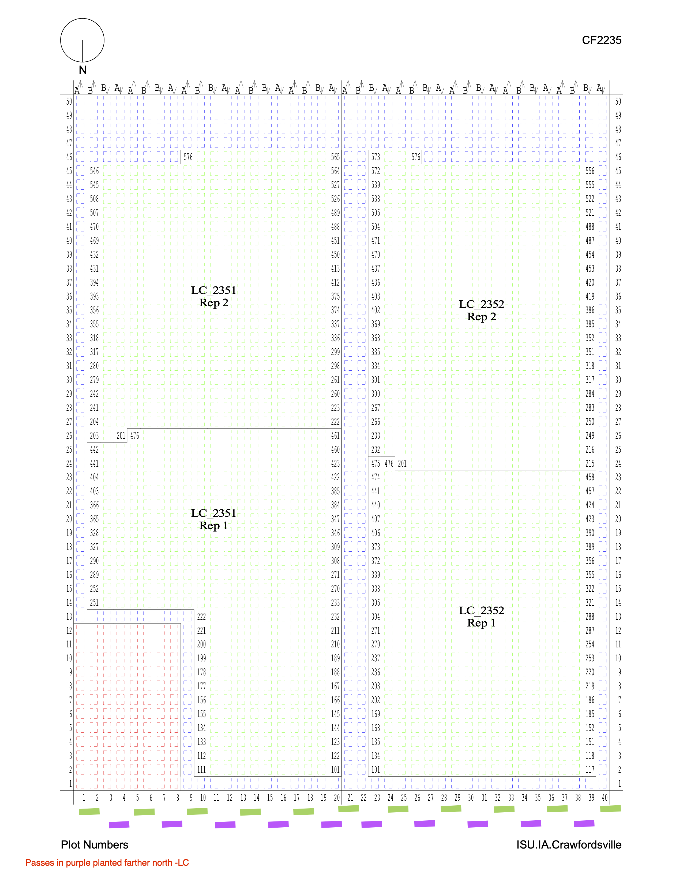

This is the documentation for the HIPS 2022 & 2023 Dataset.

# Variable Definitions And Notes

Each of the following variables includes notes on how the trait was
collected and the original data file the data was taken from and any
specific notes regarding errors or data cleaning done. Variables are
listed by the name used in the final version of the data set. For all
quantitative variables, observations an order of magnitude larger than
other observations, those appearing as extreme outliers in histograms,
and those appearing outside the primary bounds of the distribution for
the location were dropped from the data set.

### qrCode

-   **Definition:** This is the QR code assigned to the plot.
-   **Units:** NA
-   **Raw Data Sources:** This information for the 2022 Lincoln location
    hybrids was taken from the sheet 'Combined Dataset' in the file
    'Summary of Lincoln Hybrid HIPS 2022 Data.xlsx'. This information
    for hybrids in the Scottsbluff, Missouri Valley, and North Platte
    locations in 2022 was taken from the file
    'HybridHIPS_plotlevelNIR\$\_v2.6.csv', and this information for
    inbreds in these locations and Lincoln in 2022 was taken from the
    file '2022 Inbred HIPS Ear Data - Turkus Curated 231117.csv'. This
    information for the Ames and Crawfordsville locations in 2022 was
    taken from the unique id field in the sheets 'RawData (4-Row)' and
    'RawData (2-Row)' in the file 'YTMC_Lisa_Plot_Coordinates_v4.xlsx'.
    In 2023, this information was taken from the unique id field in the
    sheets '4-row plots' and '2-row plots' in the file
    '2023_yield_ICIA_v3.xlsx' for the Ames and Crawfordsville locations.
    For the North Platte, Lincoln, and Missouri Valley 2023 locations,
    this information was taken from the sheets 'North Platte Hybrids -
    Index', 'Lincoln Hybrids - Index', 'Lincoln Inbreds - Index',
    'Missouri Valley Hybrids - Index', and 'Missouri Valley Inbreds -
    Index' in the file 'Summary of HIPS 2023 Maps for Fields Visited by
    J Schanble Lab.xlsm'.
-   **Data Processing Notes:** These were maintained as in the original
    data, but were converted to all uppercase.

### location

-   **Definition:** This is the location the plot was grown in. In the
    case of North Platte 2022, it is treated as 3 separate locations to
    account for the duplication of range and row numbers across the
    different irrigation levels.
-   **Units:** NA
-   **Raw Data Sources:** NA
-   **Data Processing Notes:** NA

### sublocation

-   **Definition:** This is the field within the location the plot was
    grown in.
-   **Units:** NA
-   **Raw Data Sources:** In all locations except Ames and
    Crawfordsville in 2022, this is the same as the `location`. This is
    information for the Ames and Crawfordsville 2022 locations was
    determined based on experiment code, which was dependent on the
    nitrogen level and the field maps.
-   **Data Processing Notes:** NA

### irrigationProvided

-   **Definition:** This is the total amount of water in inches provided
    to the plot via irrigation over the course of the growing season.
-   **Units:** inches
-   **Raw Data Sources:** This information for Lincoln, Missouri Valley,
    Ames, and Crawfordsville sites was taken from personal
    communications indicating no irrigation was applied to these sites
    during either growing season. This information for the 2022
    Scottsbluff site was taken from personal communications. This
    information for the 2022 North Platte locations was taken from the
    file '2022_HIPS_Irrigation_North_Platte.xlsx'. This information for
    the 2023 North Platte location was taken from the file
    '2023_Irrigation_North_Platte.xlsx'.
-   **Data Processing Notes:** NA

### nitrogenTreatment

-   **Definition:** This is the categorical level of nitrogen fertilizer
    the plot was supplied with. Plots denoted as 'Low' received a rate
    of 75 lbs/acre. Plots denoted as 'Medium' received a rate between
    150 and 175 lbs/acre. Plots denoted as 'High' received a rate
    between 225 and 250 lbs/acre.
-   **Units:** NA
-   **Raw Data Sources:** This information for the 2022 Lincoln location
    hybrids was taken from the sheet 'Combined Dataset' in the file
    'Summary of Lincoln Hybrid HIPS 2022 Data.xlsx'. This information
    for hybrids in the Scottsbluff, Missouri Valley, and North Platte
    locations in 2022 was taken from the file
    'HybridHIPS_plotlevelNIR\$\_v2.6.csv', and this information for
    inbreds in these locations and Lincoln in 2022 was taken from the
    file '2022 Inbred HIPS Ear Data - Turkus Curated 231117.csv'. This
    information for the Ames and Crawfordsville locations in 2022 was
    based on the experiment codes, which were dependent on the nitrogen
    treatment. In 2023, this information was taken from the N level
    field in the sheets '4-row plots' and '2-row plots' in the file
    '2023_yield_ICIA_v3.xlsx' for the Ames and Crawfordsville locations.
    For the North Platte, Lincoln, and Missouri Valley 2023 locations,
    this information was taken from the sheets 'North Platte Hybrids -
    Index', 'Lincoln Hybrids - Index', 'Lincoln Inbreds - Index',
    'Missouri Valley Hybrids - Index', and 'Missouri Valley Inbreds -
    Index' in the file 'Summary of HIPS 2023 Maps for Fields Visited by
    J Schanble Lab.xlsm'.
-   **Data Processing Notes:** In Scottsbluff, based on the yield and
    grain protein content data, the labels in the plot maps and the QR
    codes for high and low nitrogen treatments were flipped. The QR
    codes are as originally scanned, and this field reflects the
    correction of this error.

### poundsOfNitrogenPerAcre

-   **Definition:** This is the rate of nitrogen fertilization the plot
    received, in pounds per acre.
-   **Units:** lbs N/acre
-   **Raw Data Sources:** This information for each plot was based on
    the data documentation for each field and the `nitrogenTreatment`
    and `location` the plot belongs to. For the Missouri Valley, Ames,
    and Crawfordsville location in 2022, this information was taken from
    the 'Basic info' sheet in the file
    'YTMC_Lisa_Plot_Coordinates_v4.xlsx'. For the Missouri Valley, Ames,
    and Crawfordsville locations in 2023, this information was taken
    from the 'Basic info' sheet in the file '2023_yield_ICIA_v3.xlsx'.
-   **Data Processing Notes:** NA

### experiment

-   **Definition:** This is the experiment code the plot belonged to,
    corresponding to nitrogen levels within a population (i.e. hybrid or
    inbred) within a location for the Missouri Valley, Ames, and
    Crawfordsville locations.
-   **Units:** NA
-   **Raw Data Sources:** This information was taken from the 'Basic
    info' sheet in the file 'YTMC_Lisa_Plot_Coordinates_v4.xlsx' for
    2022 and '2023_yield_ICIA_v3.xlsx' for 2023. Experiment codes were
    not assigned to Lincoln, North Platte, and Scottsbluff locations.
-   **Data Processing Notes:** NA

### plotLength

-   **Definition:** This is the planted length of the plot in feet.
-   **Units:** feet
-   **Raw Data Sources:** This information for North Platte 2022 was
    taken from the sheets 'No Irr Data', 'Reduced Irr Data', and 'Full
    Data' in the file '2022_Schnable_HIPS_data_v4.xlsx'. For both 2022
    and 2023, this information for the Lincoln location was taken from
    personal communications with Jon Turkus. This information for
    Missouri Vallley, Scottsbluff, Ames, and Crawfordsville in 2022 and
    2023 was taken from personal communications with Lisa Coffey.
-   **Data Processing Notes:** NA

### totalStandCount

-   **Definition:** This is the number of standing plants in two rows.
    In the case of hybrids, this is the middle two rows of the four-row
    plot, and in the case of inbreds, both rows of the two-row plot.
-   **Units:** NA
-   **Raw Data Sources:** This information ('Stand') for Missouri
    Valley, Crawfordsville, and Ames in 2022 was taken from the sheets
    'RawData (4-Row)' and 'RawData (2-Row)' for hybrids and inbreds,
    respectively, in the file 'YTMC_Lisa_Plot_Coordinates_v4.xlsx'. This
    information for North Platte 2022 was taken from the sheets 'No Irr
    Data', 'Reduced Irr Data', and 'Full Data' in the file
    '2022_Schnable_HIPS_data_v4.xlsx' as the sum of the columns 'R1
    Stand' and 'R2 Stand'. This data was not collected for the hybrid
    field at Lincoln in 2022. This information for inbreds in Lincoln in
    2022 was taken from the sheet 'Comparison' in the file '2022 SAM
    Stand Counts - Summary.xlsx'. This data was not collected in 2023 in
    Ames, Crawfordsville, or Missouri Valley. This information for
    hybrids in 2023 in Lincoln was taken from the file
    '2023HYB_HIPS_standing_count.csv'. This information for the 2023
    Lincoln inbreds was taken from the file
    '2023SAM_standing_count.csv'. This information for the North Platte
    2023 location was taken from sheet 'Data' in the file '2023 Schnable
    hips_data_v2.xlsx'.
-   **Data Processing Notes:** In the 2023 inbreds, values greater than
    50 were visual outliers and converted to missing values.

### block

-   **Definition:** This is the block number of the plot within a
    `sublocation`. These values were assigned based on the `location`,
    `sublocation`, and rep number [not included] associated with a plot.
-   **Units:** NA
-   **Raw Data Sources:** This information for the Lincoln 2022 location
    hybrids was taken from the sheet 'Combined Dataset' in the file
    'Summary of Lincoln Hybrid HIPS 2022 Data.xlsx'. This information
    for the hybrids in the 2022 Scottsbluff, Missouri Valley, and North
    Platte locations was taken from the file
    'HybridHIPS_plotlevelNIR\$\_v2.6.csv', and this information for
    inbreds in these locations and Lincoln in 2022 was taken from the
    file '2022 Inbred HIPS Ear Data - Turkus Curated 231117.csv'. This
    information for the 2022 Missouri Valley, Ames, and Crawfordsville
    locations was taken from the sheets 'RawData (4-Row)' and 'RawData
    (2-Row)' in the file 'YTMC_Lisa_Plot_Coordinates_v4.xlsx'. In 2023,
    this information was taken from the N level field in the sheets
    '4-row plots' and '2-row plots' in the file
    '2023_yield_ICIA_v3.xlsx' for the Ames and Crawfordsville locations.
    For the North Platte, Lincoln, and Missouri Valley 2023 locations,
    this information was taken from the sheets 'North Platte Hybrids -
    Index', 'Lincoln Hybrids - Index', 'Lincoln Inbreds - Index',
    'Missouri Valley Hybrids - Index', and 'Missouri Valley Inbreds -
    Index' in the file 'Summary of HIPS 2023 Maps for Fields Visited by
    J Schanble Lab.xlsm'. When the rep number was odd, the `block`
    number assigned was also odd. The same convention was maintained for
    even rep numbers.
-   **Data Processing Notes:** The rep numbers were misassigned in the
    QR codes used for ear phenotypes and NIR measurements for the 2022
    Missouri Valley hybrids, and have been corrected in the `block`
    column in the dataset.

### row

-   **Definition:** This is the row number within a `sublocation` the
    plot was located in.
-   **Units:** NA
-   **Raw Data Sources:** This information for the 2022 Lincoln location
    hybrids was taken from the sheet 'Combined Dataset' in the file
    'Summary of Lincoln Hybrid HIPS 2022 Data.xlsx'. This information
    for hybrids in the 2022 Scottsbluff, Missouri Valley, and North
    Platte locations was taken from the file
    'HybridHIPS_plotlevelNIR\$\_v2.6.csv', and this information for
    inbreds in these locations and Lincoln in 2022 was taken from the
    file '2022 Inbred HIPS Ear Data - Turkus Curated 231117.csv'. This
    information for the 2022 Ames and Crawfordsville locations was taken
    from the sheets 'RawData (4-Row)' and 'RawData (2-Row)' in the file
    'YTMC_Lisa_Plot_Coordinates_v4.xlsx'. In 2023, this information was
    taken from the N level field in the sheets '4-row plots' and '2-row
    plots' in the file '2023_yield_ICIA_v3.xlsx' for the Ames and
    Crawfordsville locations. For the North Platte, Lincoln, and
    Missouri Valley 2023 locations, this information was taken from the
    sheets 'North Platte Hybrids - Index', 'Lincoln Hybrids - Index',
    'Lincoln Inbreds - Index', 'Missouri Valley Hybrids - Index', and
    'Missouri Valley Inbreds - Index' in the file 'Summary of HIPS 2023
    Maps for Fields Visited by J Schanble Lab.xlsm'. In some files, this
    is denoted as 'Pass'.
-   **Data Processing Notes:** NA

### range

-   **Definition:** This is the range number within a `sublocation` the
    plot was located in.
-   **Units:** NA
-   **Raw Data Sources:** This information for the Lincoln location
    hybrids was taken from the sheet 'Combined Dataset' in the file
    'Summary of Lincoln Hybrid HIPS 2022 Data.xlsx'. This information
    for the hybrids in the Scottsbluff, Missouri Valley, and North
    Platte locations was taken from the file
    'HybridHIPS_plotlevelNIR\$\_v2.6.csv', and this information for
    inbreds in these locations and Lincoln in 2022 was taken from the
    file '2022 Inbred HIPS Ear Data - Turkus Curated 231117.csv'. This
    information for the Ames and Crawfordsville locations was taken from
    the sheets 'RawData (4-Row)' and 'RawData (2-Row)' in the file
    'YTMC_Lisa_Plot_Coordinates_v4.xlsx'. In 2023, this information was
    taken from the N level field in the sheets '4-row plots' and '2-row
    plots' in the file '2023_yield_ICIA_v3.xlsx' for the Ames and
    Crawfordsville locations. For the North Platte, Lincoln, and
    Missouri Valley 2023 locations, this information was taken from the
    sheets 'North Platte Hybrids - Index', 'Lincoln Hybrids - Index',
    'Lincoln Inbreds - Index', 'Missouri Valley Hybrids - Index', and
    'Missouri Valley Inbreds - Index' in the file 'Summary of HIPS 2023
    Maps for Fields Visited by J Schanble Lab.xlsm'.
-   **Data Processing Notes:** NA

### plotNumber

-   **Definition:** This is the number assigned to the plot.
-   **Units:** NA
-   **Raw Data Sources:** This information for the Lincoln location
    hybrids was taken from the sheet 'Combined Dataset' in the file
    'Summary of Lincoln Hybrid HIPS 2022 Data.xlsx'. This information
    for the hybrids in the Scottsbluff, Missouri Valley, and North
    Platte locations was taken from the file
    'HybridHIPS_plotlevelNIR\$\_v2.6.csv', and this information for
    inbreds in these locations and Lincoln in 2022 was taken from the
    file '2022 Inbred HIPS Ear Data - Turkus Curated 231117.csv'. This
    information for the Ames and Crawfordsville locations was taken from
    the sheets 'RawData (4-Row)' and 'RawData (2-Row)' in the file
    'YTMC_Lisa_Plot_Coordinates_v4.xlsx'. In 2023, this information was
    taken from the N level field in the sheets '4-row plots' and '2-row
    plots' in the file '2023_yield_ICIA_v3.xlsx' for the Ames and
    Crawfordsville locations. For the North Platte, Lincoln, and
    Missouri Valley 2023 locations, this information was taken from the
    sheets 'North Platte Hybrids - Index', 'Lincoln Hybrids - Index',
    'Lincoln Inbreds - Index', 'Missouri Valley Hybrids - Index', and
    'Missouri Valley Inbreds - Index' in the file 'Summary of HIPS 2023
    Maps for Fields Visited by J Schanble Lab.xlsm'.
-   **Data Processing Notes:** In the Scottsbluff hybrids in 2022, it
    was determined based on correlations between replicates of genotypes
    that planting of the lowest numbered plots actually started in the
    SW corner of the field rather than the SE corner as indicated by the
    field maps. The plot numbers in the `qrCode` were transformed to the
    plot number assigned to that row and range in the original field
    maps. In Missouri Valley 2022, 100 was added to hybrid plot numbers
    in `block` 1 and 200 was added to hybrid plot numbers in `block` 2
    to de-duplicate the plot numbers within the `location`. In Missouri
    Valley 2022, 400 was added to the inbred plot numbers in `block` 2
    to de-duplicate the plot numbers within the `location`. In the
    Missouri Valley 2023 inbreds, 400 was added to inbred plot numbers
    in `block` 2 to de-duplicate the plot numbers.

### genotype

-   **Definition:** This is the genotype grown in the plot.
-   **Units:** NA
-   **Raw Data Sources:** This information for the Lincoln location
    hybrids was taken from the sheet 'Combined Dataset' in the file
    'Summary of Lincoln Hybrid HIPS 2022 Data.xlsx'. This information
    for the hybrids in the Scottsbluff, Missouri Valley, and North
    Platte locations was taken from the file
    'HybridHIPS_plotlevelNIR\$\_v2.6.csv', and this information for
    inbreds in these locations and Lincoln in 2022 was taken from the
    file '2022 Inbred HIPS Ear Data - Turkus Curated 231117.csv'. This
    information for the Ames and Crawfordsville locations was taken from
    the sheets 'RawData (4-Row)' and 'RawData (2-Row)' in the file
    'YTMC_Lisa_Plot_Coordinates_v4.xlsx'. In 2023, this information was
    taken from the N level field in the sheets '4-row plots' and '2-row
    plots' in the file '2023_yield_ICIA_v3.xlsx' for the Ames and
    Crawfordsville locations. For the North Platte, Lincoln, and
    Missouri Valley 2023 locations, this information was taken from the
    sheets 'North Platte Hybrids - Index', 'Lincoln Hybrids - Index',
    'Lincoln Inbreds - Index', 'Missouri Valley Hybrids - Index', and
    'Missouri Valley Inbreds - Index' in the file 'Summary of HIPS 2023
    Maps for Fields Visited by J Schanble Lab.xlsm'.
-   **Data Processing Notes:** All characters in genotype names were
    converted to uppercase. Some plots' genotypes were listed as 'SOLAR'
    1-4, withno note on the hybrid grown in the plot. These plots'
    genotypes were transformed to NA, with a note on the solar panel in
    the notes field. Genotype names truncated in `qrCode` were changed
    to their full version, genotype names of the form 'COMMERCIAL HYBRID
    X' were converted to the market name of the commercial hybrid,
    'FILLER' was converted to the actual genotype name when known or NA
    if unknown. Additionally, typos in the genotype names '4N506 X
    3IIH!6' and 'PHP02 X PHJ894' were corrected to '4N506 X 3IIH6' and
    'PHP02 X PHJ89', respectively.

### plantingDate

-   **Definition:** This is the date the plot was planted.
-   **Units:** NA
-   **Raw Data Sources:** This information for each plot was based on
    the data documentation for each field. For the Missouri Valley,
    Ames, and Crawfordsville locations, this information was taken from
    the sheet 'Field Info' in the file
    YTMC_Lisa_Plot_Coordinates_v4.xlsx' in 2022 and the file
    '2023_yield_ICIA_v3.xlsx' in 2023. For the Scottsbluff, North
    Platte, and Lincoln locations, this information was taken from
    personal communications in both 2022 and 2023.
-   **Data Processing Notes:** NA

### anthesisDate

-   **Definition:** This is the date when 50% of plants in the plot
    reached anthesis (tasseling).
-   **Units:** NA
-   **Raw Data Sources:** This information for the 2022 Lincoln location
    hybrids was taken from the sheet 'Combined Dataset' in the file
    'Summary of Lincoln Hybrid HIPS 2022 Data.xlsx'. This information
    for the 2022 Lincoln location inbreds was taken from the sheet 'SAM'
    in the file '2022 Digitized Flowering Notes.xlsx'. This information
    for the 2022 Scottsbluff location hybrids and inbreds was taken from
    the sheets 'Hybrid_flowering data' and 'Inbred_flowering_data' in
    the file 'Corn_data_Scottsbluff-2022_rk_11.11.2022'. This
    information for the 2022 North Platte locations was taken from the
    sheets 'Full Data', 'Reduced Irr Data', and 'No Irr Data' in the
    file '2022_Schnable_HIPS_data_v4.xlsx'. This information for the
    2023 hybrids in Lincoln was taken from the file 'Hybrid Hips
    flowering NOTEs 2023 (1).xlsx'. This information for the 2023
    inbreds in Lincoln was taken from the file 'UNL Inbreds flowering
    note 2023 - Ullagaddi Transcribed.csv'. This information for the
    2023 North Platte location was taken from the file '2023 Schnable
    hips_data_v2.xlsx'. This data was not collected at the Missouri
    Valley, Crawfordsville, and Ames locations in either year.
-   **Data Processing Notes:** In the 2023 hybrids, the `anthesisDate`
    for plot 146 in North Platte was in December 1901, so it was removed
    as a data entry error.

### silkDate

-   **Definition:** This is the date when 50% of plants in the plot
    reached silking.
-   **Units:** NA
-   **Raw Data Sources:** This information for the 2022 Lincoln location
    hybrids was taken from the sheet 'Combined Dataset' in the file
    'Summary of Lincoln Hybrid HIPS 2022 Data.xlsx'. This information
    for the 2022 Lincoln location inbreds was taken from the sheet 'SAM'
    in the file '2022 Digitized Flowering Notes.xlsx'. This information
    for the 2022 Scottsbluff location hybrids and inbreds was taken from
    the sheets 'Hybrid_flowering data' and 'Inbred_flowering_data' in
    the file 'Corn_data_Scottsbluff-2022_rk_11.11.2022'. This
    information for the 2022 North Platte locations was taken from the
    sheets 'Full Data', 'Reduced Irr Data', and 'No Irr Data' in the
    file '2022_Schnable_HIPS_data_v4.xlsx'. This information for the
    2023 hybrids in Lincoln was taken from the file 'Hybrid Hips
    flowering NOTEs 2023 (1).xlsx'. This information for the 2023
    inbreds in Lincoln was taken from the file 'UNL Inbreds flowering
    note 2023 - Ullagaddi Transcribed.csv'. This information for the
    2023 North Platte location was taken from the file '2023 Schnable
    hips_data_v2.xlsx'. This data was not collected at the Missouri
    Valley, Crawfordsville, and Ames locations in either year.
-   **Data Processing Notes:** In the 2023 hybrids, the `silkDate` for
    plot 349 in North Platte was in January 1900, so it was removed as a
    data entry error.

### daysToAnthesis

-   **Definition:** This is the number of days between the
    `plantingDate` and `anthesisDate`.
-   **Units:** days
-   **Raw Data Sources:** NA
-   **Data Processing Notes:** In the 2023 hybrids, the `anthesisDate`
    for plot 146 in North Platte was in December 1901, so it was removed
    as a data entry error. Furthermore, all values less than 50 days
    were visual outliers and were converted to missing values. In the
    2023 inbreds, all values less than 42.5 days were visual outliers
    and converted to missing values.

### daysToSilk

-   **Definition:** This is the number of days between the
    `plantingDate` and `silkDate`.
-   **Units:** days
-   **Raw Data Sources:** NA
-   **Data Processing Notes:** Plots 1397 at North Platte and 1156 at
    Scottsbluff were visual outliers in scatterplots and were dropped.
    In the 2022 inbreds, values greater than 110 days were visual
    outliers and were converted to missing values. In the 2023 hybrids,
    the `silkDate` for plot 349 in North Platte was in January 1900, so
    it was removed as a data entry error.

### anthesisSilkingInterval

-   **Definition:** This is the anthesis-silking interval in days, and
    is calculated as the difference between the `silkDate` and
    `anthesisDate` for a plot.
-   **Units:** days
-   **Raw Data Sources:** NA
-   **Data Processing Notes:** Negative values indicate that silking
    occurred prior to anthesis. Values greater than 20 days were visual
    outliers in the histogram and were dropped. In the 2022 inbreds,
    values less than -10 days or greater than 20 days were visual
    outliers and were converted to missing values. In the 2023 hybrids,
    plots 146 and 349 in North Platte had data entry errors in either
    `anthesisDate` or `silkDate` and so `anthesisSilkingInterval` was
    not calculated. Furthermore, all values greater than 15 days were
    visual outliers and were converted to missing values. In the 2023
    inbreds, values less than -15 or greater than 25 days were visual
    outliers and converted to missing values.

### GDDToAnthesis

-   **Definition:** This is the cumulative number of GDDs for the
    location on between `plantingDate` and `anthesisDate` for the plot.
-   **Units:** growing degree days (GDDs)
-   **Raw Data Sources:** In-field weather station data for the 2022
    growing season was taken from the files in the directory 'weather'.
    In-field weather station data for the 2023 growing season was taken
    from the files in the directory '2023/2023 Weather Stations'.
-   **Data Processing Notes:** GDDs were calculated using temperatures
    in Fahrenheit with a crop base temperature of 50 degrees and a crop
    maximum temperature of 86 degrees. Where there was a weather station
    data for the field, the temperatures recorded therein were used to
    calculate the daily minimum and maximum temperatures and converted
    from Celsius if needed. In cases where there was missing data or the
    maximum temperature was above the maximum observed temperature for
    the nearest town, data was imputed from NASA POWER using the
    latitude and longitude of the center of the plot. In Crawfordsville
    2022, there was no weather station but a G2F field was located
    nearby. The weather data for Crawfordsville 2022 was accessed from
    <doi:10.25739/3d3g-pe51> for the site IAH1. This data was previously
    cleaned and imputed using data from NASA. In the 2022 hybrids,
    values in Lincoln greater than 2250 GDDs, values in North Platte1
    less than 1750 GDDs, values in North Platte3 less than 2250 or
    greater than 3500 GDDs, and values in Scottsbluff less than 1500
    GDDs were visual outliers in the histogram and were dropped. In the
    2023 hybrids, values less than 1100 were visual outliers and
    converted to missing values. In the 2023 inbreds, values less than
    1000 GDDs were visual outliers and converted to missing values.

### GDDToSilk

-   **Definition:** This is the cumulative number of GDDs for the
    location on between `plantingDate` and `silkDate` for the plot.
-   **Units:** growing degree days (GDDs)
-   **Raw Data Sources:** In-field weather station data for the 2022
    growing season was taken from the files in the directory 'weather'.
    In-field weather station data for the 2023 growing season was taken
    from the files in the directory '2023/2023 Weather Stations'.
-   **Data Processing Notes:** GDDs were calculated using temperatures
    in Fahrenheit with a crop base temperature of 50 degrees and a crop
    maximum temperature of 86 degrees. Where there was a weather station
    data for the field, the temperatures recorded therein were used to
    calculate the daily minimum and maximum temperatures and converted
    from Celsius if needed. In cases where there was missing data or the
    maximum temperature was above the maximum observed temperature for
    the nearest town, data was imputed from NASA POWER using the
    latitude and longitude of the center of the plot. In Crawfordsville
    2022, there was no weather station but a G2F field was located
    nearby. The weather data for Crawfordsville 2022 was accessed from
    <doi:10.25739/3d3g-pe51> for the site IAH1. This data was previously
    cleaned and imputed using data from NASA. Values greater than 3500
    GDDs in the 2022 hybrids were visual outliers in the histogram and
    were dropped. In the 2022 inbreds, all values greater than 2200 GDDs
    were visual outliers and were converted to missing values. In the
    2023 hybrids, values less than 1100 were visual outliers and
    converted to missing values. In the 2023 inbreds, values less than
    1000 or greater than 2800 GDDs were visual outliers and converted to
    missing values.

### anthesisSilkingIntervalGDD

-   **Definition:** This is the cumulative number of GDDs for the
    location on between `anthesisDate` and `silkDate` for the plot.
-   **Units:** growing degree days (GDDs)
-   **Raw Data Sources:** Negative values indicate silking occurred
    prior to anthesis. In-field weather station data for the 2022
    growing season was taken from the files in the directory 'weather'.
    In-field weather station data for the 2023 growing season was taken
    from the files in the directory '2023/2023 Weather Stations'.
-   **Data Processing Notes:** GDDs were calculated using temperatures
    in Fahrenheit with a crop base temperature of 50 degrees and a crop
    maximum temperature of 86 degrees. Where there was a weather station
    data for the field, the temperatures recorded therein were used to
    calculate the daily minimum and maximum temperatures and converted
    from Celsius if needed. In cases where there was missing data or the
    maximum temperature was above the maximum observed temperature for
    the nearest town, data was imputed from NASA POWER using the
    latitude and longitude of the center of the plot. In Crawfordsville
    2022, there was no weather station but a G2F field was located
    nearby. The weather data for Crawfordsville 2022 was accessed from
    <doi:10.25739/3d3g-pe51> for the site IAH1. This data was previously
    cleaned and imputed using data from NASA. Values greater than 500,
    values in North Platte1 greater than 250, and values in Scottsbluff
    greater than 375 were visual outliers and converted to missing
    values. In the 2022 inbreds, values less than -250 or greater than
    500 GDDs were visual outliers and were converted to missing values.
    In the 2023 hybrids, values less than -50 or greater than 200 were
    visual outliers and converted to missing values. In the 2023
    inbreds, all values less than -500 or greater than 1000 GDDs were
    visual outliers and converted to missing values.

### earHeight

-   **Definition:** This is the height in centimeters of the point of
    attachment to the stalk of the top ear.
-   **Units:** cm
-   **Raw Data Sources:** This information for the 2022 Lincoln location
    hybrids was taken from the sheet 'Combined Dataset' in the file
    'Summary of Lincoln Hybrid HIPS 2022 Data.xlsx'. For the 2022
    Lincoln inbreds, this information was taken from the file '230331
    SAM Height and Leaf Dimension Data Data - Digitized and
    Reviewed.xlsx'. For Scottsbluff hybrids, this data was taken from
    the sheet 'Hybrid_height data' from the file
    'Corn_data_Scottsbluff-2022_rk_11.11.2022' and converted from
    inches. This information for the North Platte 2022 location was
    taken from the sheets 'Full Data', 'Reduced Irr Data', and 'No Irr
    Data' in the file '2022_Schnable_HIPS_data_v4.xlsx' and converted
    from meters. This information for Missouri Valley 2022 was taken
    from the file 'Plant_data_MO_Valley_2022.xlsx'. This information for
    Ames 2022 was taken from the file 'Plant_data_Ames_2022.xlsx.' This
    information for Crawfordsville 2022 was taken from the file
    'Plant_data_Crawfordsville.xlsx'. This information for North Platte
    2023 was taken from the file '2023 Schnable hips_data_v2.xlsx' and
    converted from meters. This information for Lincoln 2023 hybrids was
    taken from the file '2023HIBHIPS_plat_height.csv' and converted from
    feet. This information for Lincoln 2023 inbreds was taken from the
    file '231018 Finalized Height Data from Lopez-Corona - Additional
    info added by Turkus.xlsx' and converted from feet. This information
    for the 2023 Missouri Valley, Ames, and Crawfordsville was taken
    from the sheets '4-row plots' and '2-row plots' in the file
    '2023_yield_ICIA_v3.xlsx'.
-   **Data Processing Notes:** In Lincoln, this is the average of
    measurements from two representative plants in the plot. In all
    other locations, it measured from a single representative plant in
    the plot. All measurements from plants noted as stunted or without a
    silk were marked as missing data prior to calculation. Ear heights
    less than 35 cm were visual outliers in the histogram and were
    dropped. Plots 5244, 5283, 5141 in Lincoln were dropped as they
    appeared to be an order of magnitude too low. In the 2022 inbreds,
    values in Crawfordsville less than 12 cm or greater than 175 cm were
    visual outliers and were converted to missing values. In the 2023
    hybrids, all values greater than 225 cm and values in North Platte
    less than 80 cm were visual outliers and were converted to missing
    values. In the 2023 inbreds, values less than 12 or greater than 200
    cm were visual outliers and converted to missing values.

### flagLeafHeight

-   **Definition:** This is the height in centimeters of the point of
    attachment to the stalk of the flag leaf.
-   **Units:** cm
-   **Raw Data Sources:** This information for the 2022 Lincoln location
    hybrids was taken from the sheet 'Combined Dataset' in the file
    'Summary of Lincoln Hybrid HIPS 2022 Data.xlsx'. For the 2022
    Lincoln inbreds, this information was taken from the file '230331
    SAM Height and Leaf Dimension Data Data - Digitized and
    Reviewed.xlsx'. For Scottsbluff hybrids, this data was taken from
    the sheet 'Hybrid_height data' from the file
    'Corn_data_Scottsbluff-2022_rk_11.11.2022' and converted from
    inches. This information for the North Platte 2022 location was
    taken from the sheets 'Full Data', 'Reduced Irr Data', and 'No Irr
    Data' in the file '2022_Schnable_HIPS_data_v4.xlsx' and converted
    from meters. This information for Missouri Valley 2022 was taken
    from the file 'Plant_data_MO_Valley_2022.xlsx'. This information for
    Ames 2022 was taken from the file 'Plant_data_Ames_2022.xlsx.' This
    information for Crawfordsville 2022 was taken from the file
    'Plant_data_Crawfordsville.xlsx'. This information for North Platte
    2023 was taken from the file '2023 Schnable hips_data_v2.xlsx' and
    converted from meters. This information for Lincoln 2023 hybrids was
    taken from the file '2023HIBHIPS_plat_height.csv' and converted from
    feet. This information for Lincoln 2023 inbreds was taken from the
    file '231018 Finalized Height Data from Lopez-Corona - Additional
    info added by Turkus.xlsx' and converted from feet. This information
    for the 2023 Missouri Valley, Ames, and Crawfordsville was taken
    from the sheets '4-row plots' and '2-row plots' in the file
    '2023_yield_ICIA_v3.xlsx'.
-   **Data Processing Notes:** In Lincoln, this is the average of
    measurements from two representative plants in the plot. In all
    other locations, it measured from a single representative plant in
    the plot. All measurements from plants noted as stunted or without a
    silk were marked as missing data prior to calculation. Plot 1322 at
    Scottsbluff was dropped due to having a value 60 cm (\~1.9 feet)
    greater than all other observations. Flag leaf heights less than 50
    cm were visual outliers in the histogram and were dropped. In the
    2022 inbreds, all values greater than 250 cm, values in Ames less
    than 45 cm, values in Lincoln less than 50 cm, and values in
    Missouri Valley less than 50 or greater than 225 cm were visual
    outliers and were converted to missing values. In the 2023 hybrids,
    all values less than 100 or greater than 350 cm were visual outliers
    and were converted to missing values. In the 2023 inbreds, values
    less than 50 or greater than 500 cm were visual outliers and
    converted to missing values.

### plantDensity

-   **Definition:** This is density of the plants per acre in the plot.
-   **Units:** plants/acre
-   **Raw Data Sources:** In the case of the 2023 Missouri Valley, Ames,
    and Crawfordsville locations, no stand count was collected, so the
    Population (acre) column in the sheets '4-row plots' and '2-row
    plots' in the file '2023_yield_ICIA_v3.xlsx' was used, which was
    based on the number of seeds planted.
-   **Data Processing Notes:** This is calculated as the mean number of
    plants per row (i.e., one-half of `totalStandCount`) scaled to be
    equivalent to 1/1000th of an acre (a `plotLength` of 17.5 feet with
    an assumed spacing of 30") and multiplied by 1000. In the 2023
    hybrids, values less than 20,000 or greater than 50,000 were visual
    outliers and were converted to missing values.

### combineYield

-   **Definition:** This is the weight, in pounds, of the grain
    harvested from the inner two rows of the plot by the combine.
-   **Units:** lbs
-   **Raw Data Sources:** This data was only collected for hybrid plots.
    This information for the 2022 Lincoln location was taken from the
    sheet 'Combined Dataset' in the file 'Summary of Lincoln Hybrid HIPS
    2022 Data.xlsx'. For the Scottsbluff location, this information was
    taken from the file 'Dipak Corn22_HM.xlsx'. This information for the
    2022 North Platte location was taken from the sheets 'Full Data',
    'Reduced Irr Data', and 'No Irr Data' in the file
    '2022_Schnable_HIPS_data_v4.xlsx.' This information for the Missouri
    Valley, Crawfordsville, and Ames locations was taken from the sheet
    'RawData (4-Row)' in the file 'YTMC_Lisa_Plot_Coordinates_v4.xlsx'.
    This information for the 2023 North Platte location was taken from
    the file '2023 Schnable hips_data_v2.xlsx'. This information for the
    2023 Lincoln location was taken from the file '231127 Hybrid HIPS
    Lincoln - Combine Harvest Data - Turkus Curated.csv'. This
    information for the 2023 Missouri Valley, Ames, and Crawfordsville
    locations was taken from the sheet '4-row plots' in the file
    '2023_yield_ICIA_v3.xlsx'.
-   **Data Processing Notes:** All observations with any of the
    following values in combineNotes were dropped: "Left row ran over",
    "Right row gone", "Run over", "Clog", "Animal damage", "Animal
    damage, not enough grain for accurate moisture", "One row", "Same as
    last", "11/9/2022, 11:45:04 AM, Tare Warning, Test Weight: 5.75",
    "Plot lost to belt issue". Plot 250 in North Platte1 was also
    dropped, as it had a weight approximately twice all other values and
    appeared that 4 rows, instead of two, were potentially harvested.
    Plots 1094, 1095, 1265, and 1435 in Scottsbluff were dropped as they
    were damaged due to solar panel removal. In Lincoln 2023, some plots
    accidentally had ears from the center row harvested during hand
    harvesting. When this was noted, these values were converted to
    missing data.

### yieldPerAcre

-   **Definition:** This is the yield, in 56-lb bushels of grain at
    15.5% moisture per acre.
-   **Units:** bushels/acre
-   **Raw Data Sources:** NA
-   **Data Processing Notes:** This value was calculated from the
    `combineYield`, `combineMoisture`, and `plotLength` values for the
    plot. This calculation assumes a 30" row spacing. In Lincoln 2023,
    some plots accidentally had ears from the center row harvested
    during hand harvesting. When this was noted, these values were
    converted to missing data. Plots 1094, 1095, 1265, and 1435 in
    Scottsbluff were dropped as they were damaged due to solar panel
    removal.

### combineMoisture

-   **Definition:** This is the moisture content, in percent, on a wet
    (fresh-weight) basis, measured by the combine at the time of
    harvesting the plot.
-   **Units:** percent
-   **Raw Data Sources:** This data was only collected for hybrid plots.
    This information for the 2022 Lincoln location was taken from the
    sheet 'Combined Dataset' in the file 'Summary of Lincoln Hybrid HIPS
    2022 Data.xlsx'. For the Scottsbluff location, this information was
    taken from the file 'Dipak Corn22_HM.xlsx'. This information for the
    2022 North Platte location was taken from the sheets 'Full Data',
    'Reduced Irr Data', and 'No Irr Data' in the file
    '2022_Schnable_HIPS_data_v4.xlsx.' This information for the Missouri
    Valley, Crawfordsville, and Ames locations was taken from the sheet
    'RawData (4-Row)' in the file 'YTMC_Lisa_Plot_Coordinates_v4.xlsx'.
    This information for the 2023 North Platte location was taken from
    the file '2023 Schnable hips_data_v2.xlsx'. This information for the
    2023 Lincoln location was taken from the file '231127 Hybrid HIPS
    Lincoln - Combine Harvest Data - Turkus Curated.csv'. This
    information for the 2023 Missouri Valley, Ames, and Crawfordsville
    locations was taken from the sheet '4-row plots' in the file
    '2023_yield_ICIA_v3.xlsx'.
-   **Data Processing Notes:** All observations equal to zero or with
    any of the following values in combineNotes were dropped: "Left row
    ran over", "Right row gone", "Run over", "Clog", "Animal damage",
    "Animal damage, not enough grain for accurate moisture", "One row",
    "Same as last", "11/9/2022, 11:45:04 AM, Tare Warning, Test Weight:
    5.75", "Plot lost to belt issue", "Water stress, not enough grain
    for accurate moisture", "Not enough grain for accurate moisture".
    Plot 250 in North Platte1 was also dropped, as it had a weight
    approximately twice all other values and appeared that 4 rows,
    instead of two, were potentially harvested. In the 2023 hybrids, all
    values less than 10 percent were visual outliers and were converted
    to missing values.

### combineTestWeight

-   **Definition:** This is the test weight, e.g. the weight in pounds
    of a volumetric bushel (1.24 cubic feet), of the grain harvested
    from the plot by the combine.
-   **Units:** lbs
-   **Raw Data Sources:** This data was only collected for hybrid plots.
    This information for the 2022 Lincoln location was taken from the
    sheet 'Combined Dataset' in the file 'Summary of Lincoln Hybrid HIPS
    2022 Data.xlsx'. For the Scottsbluff location, this information was
    taken from the file 'Dipak Corn22_HM.xlsx'. This information for the
    2022 North Platte location was taken from the sheets 'Full Data',
    'Reduced Irr Data', and 'No Irr Data' in the file
    '2022_Schnable_HIPS_data_v4.xlsx.' This information for the Missouri
    Valley, Crawfordsville, and Ames locations was taken from the sheet
    'RawData (4-Row)' in the file 'YTMC_Lisa_Plot_Coordinates_v4.xlsx'.
    This information for the 2023 North Platte location was taken from
    the file '2023 Schnable hips_data_v2.xlsx'. This information for the
    2023 Lincoln location was taken from the file '231127 Hybrid HIPS
    Lincoln - Combine Harvest Data - Turkus Curated.csv'. This
    information for the 2023 Missouri Valley, Ames, and Crawfordsville
    locations was taken from the sheet '4-row plots' in the file
    '2023_yield_ICIA_v3.xlsx'.
-   **Data Processing Notes:** All observations equal to zero or with
    any of the following values in combineNotes were dropped: "Left row
    ran over", "Right row gone", "Run over", "Clog", "Animal damage",
    "Animal damage, not enough grain for accurate moisture", "One row",
    "Same as last", "11/9/2022, 11:45:04 AM, Tare Warning, Test Weight:
    5.75", "Plot lost to belt issue". Plot 250 in North Platte1 was also
    dropped, as it had a weight approximately twice all other values and
    appeared that 4 rows, instead of two, were potentially harvested.
    For the Missouri Valley, Ames, and Crawfordsville locations, this
    data was taken from the file 'YTMC_Lisa_Plot_Coordinates_v4.xlsx'.
    In the 2023 hybrids, all values less than 45 pounds were visual
    outliers and were converted to missing values.

### earLength

-   **Definition:** This is the mean length of the cob after shelling
    (i.e. with the kernels removed) of one ear from the plot.
-   **Units:** cm
-   **Raw Data Sources:** This information for hybrids at the 2022
    Scottsbluff, North Platte, Lincoln, and Missouri Valley locations
    was taken from the file 'plotleveleardata_v2.csv'. This information
    for the hybrid 2022 Ames and Crawfordsville locations was taken from
    the files in the folder '5 Cob Traits Station' and converted from
    millimeters to centimeters. This information for the 2022 inbreds at
    the Lincoln and Missouri Valley locations was taken from the file
    '2022 Inbred HIPS Ear Data - Turkus Curated 231117.csv' and
    converted from millimeters. This information for the inbred 2022
    Ames and Crawfordsville locations was taken from the file
    '5_cob_trait_INBRED_2022_compiled_v2.xlsx'. This information for the
    hybrids at the 2023 North Platte, Lincoln, and Missouri Valley
    locations was taken from the file
    '2023_Hyb_HIPS_LNK_MV_NP_Final_KL_Curated.xlsx'. This information
    for the hybrid 2023 Ames and Crawfordsville locations was taken from
    the file '5_cob_Traits_HYBRID_2023_compiled.xlsx'. This information
    for the inbred 2023 Lincoln and Missouri Valley locations was taken
    from the file
    '2023_Inbred_Hips_Ear_Phenotyping_MV_LNK_Final_KL_Curated.xlsx'.
-   **Data Processing Notes:** Plot 426 in North Platte1 was dropped as
    all underlying observations were an order of magnitude larger than
    all other observations. For Ames and Crawfordsville locations, when
    the ear had severe bending, a string was used to measure the length
    and this is denoted in the notes field. In the 2022 inbreds, all
    values greater than 30 cm were visual outliers and converted to
    missing values. Furthermore, values in Ames greather than 25 cm,
    values in Crawfordsville less than 5 or greater than 21 cm, and
    values in Missouri Valley greater than 20 cm were visual outliers
    and converted to missing values. In the 2023 hybrids, all values
    greater than 22.5 cm, values in Crawfordsville less than 12.5 cm,
    and values in North Platte less than 10 or greater than 20 cm were
    visual outliers and converted to missing values. In the 2023
    inbreds, values in Lincoln greater than 17.5 cm were visual outliers
    and converted to missing values.

### earFillLength

-   **Definition:** This is the mean length filled with kernels on one
    ear from the plot in centimeters prior to shelling (i.e. with the
    kernels attached to the cob).
-   **Units:** cm
-   **Raw Data Sources:** This information for hybrids at the 2022
    Scottsbluff, North Platte, Lincoln, and Missouri Valley locations
    was taken from the file 'plotleveleardata_v2.csv'. This information
    was not collected for Ames or Crawfordsville locations. This
    information for the 2022 inbreds at the Lincoln and Missouri Valley
    locations was taken from the file '2022 Inbred HIPS Ear Data -
    Turkus Curated 231117.csv' and converted from millimeters. This
    information for the hybrids at the 2023 North Platte, Lincoln, and
    Missouri Valley locations was taken from the file
    '2023_Hyb_HIPS_LNK_MV_NP_Final_KL_Curated.xlsx'. This information
    for the inbred 2023 Lincoln and Missouri Valley locations was taken
    from the file
    '2023_Inbred_Hips_Ear_Phenotyping_MV_LNK_Final_KL_Curated.xlsx'.
-   **Data Processing Notes:** Plot 426 in North Platte1 was dropped as
    all underlying observations were an order of magnitude larger than
    all other observations, and the mean for plots 879 and 837 in North
    Platte2 was calculated from 3 (rather than 4) ears due to the
    observation for the fourth ear being an order of magnitude larger
    than all other observations. This data was initially not collected
    for ears phenotyped by the UNL team (North Platte, Scottsbluff,
    Lincoln, Missouri Valley), but began approximately one-third of the
    way through phenotyping the first hybrid location in 2022, Missouri
    Valley. In the 2022 inbreds, values in Lincoln less than 2.5 or
    greater than 17 cm, values in Missouri Valley greater than 20 cm,
    and values in Scottsbluff greater than 18 cm were visual outliers
    and were converted to missing values. In the 2023 inbreds, values in
    Lincoln less than 3.75 cm wer visual outliers and converted to
    missing values.

### earWidth

-   **Definition:** This is the mean width of one ear from the plot in
    centimeters prior to shelling (i.e. with the kernels attached to the
    cob).
-   **Units:** cm
-   **Raw Data Sources:** This information for hybrids at the 2022
    Scottsbluff, North Platte, Lincoln, and Missouri Valley locations
    was taken from the file 'plotleveleardata_v2.csv'. This information
    for the hybrid 2022 Ames and Crawfordsville locations was taken from
    the files in the folder '3 Ear Traits Station' and converted from
    millimeters to centimeters. This information for the 2022 inbreds at
    the Lincoln and Missouri Valley locations was taken from the file
    '2022 Inbred HIPS Ear Data - Turkus Curated 231117.csv' and
    converted from millimeters. This information for the inbred 2022
    Ames and Crawfordsville locations was taken from the file
    '3_ear_trait_INBRED_2022_compiled_v2.xlsx'. This information for the
    hybrids at the 2023 North Platte, Lincoln, and Missouri Valley
    locations was taken from the file
    '2023_Hyb_HIPS_LNK_MV_NP_Final_KL_Curated.xlsx'. This information
    for the hybrid 2023 Ames and Crawfordsville locations was taken from
    the file '3_ear_Traits_HYBRID_2023_compiled.xlsx'. This information
    for the inbred 2023 Lincoln and Missouri Valley locations was taken
    from the file
    '2023_Inbred_Hips_Ear_Phenotyping_MV_LNK_Final_KL_Curated.xlsx'.
-   **Data Processing Notes:** Plot 426 in North Platte1 was dropped as
    all underlying observations were an order of magnitude larger than
    all other observations. Plot 6129 at Lincoln and plot 1585236 were
    calculated using 3 rather than 4 ears as the remaining observation
    was an order of magnitude larger than the other observations. In the
    2022 inbreds, Lincoln plot 1115 was calculated as the mean of 4 ears
    rather than 6 as the remaining observations appeared to be data
    entry errors. In the 2022 inbreds, values greater than 10 cm were
    visual outliers and were converted to missing values. Furthermore,
    values in Ames and Crawfordsville greater than 5.5 cm, values in
    Lincoln less than 2 or greater than 4.25 cm, and values in Missouri
    Vallley greater than 5 cm were visual outliers and were converted to
    missing values. In the 2023 hybrids, all values less than 3.5 cm
    were visual outliers and converted to missing values. In the 2023
    inbreds, values in Missouri Valley less than 2.5 cm were visual
    outliers and converted to missing values.

### shelledCobWidth

-   **Definition:** This is the mean width of one cob from the plot in
    centimeters after shelling (i.e. with the kernels removed from the
    cob).
-   **Units:** cm
-   **Raw Data Sources:** This information for hybrids at the 2022
    Scottsbluff, North Platte, Lincoln, and Missouri Valley locations
    was taken from the file 'plotleveleardata_v2.csv'. This information
    for the hybrid 2022 Ames and Crawfordsville locations was taken from
    the files in the folder '5 Cob Traits Station' and converted from
    millimeters to centimeters. This information for the 2022 inbreds at
    the Lincoln and Missouri Valley locations was taken from the file
    '2022 Inbred HIPS Ear Data - Turkus Curated 231117.csv' and
    converted from millimeters. This information for the inbred 2022
    Ames and Crawfordsville locations was taken from the file
    '5_cob_trait_INBRED_2022_compiled_v2.xlsx'. This information for the
    hybrids at the 2023 North Platte, Lincoln, and Missouri Valley
    locations was taken from the file
    '2023_Hyb_HIPS_LNK_MV_NP_Final_KL_Curated.xlsx'. This information
    for the hybrid 2023 Ames and Crawfordsville locations was taken from
    the file '5_cob_Traits_HYBRID_2023_compiled.xlsx'. This information
    for the inbred 2023 Lincoln and Missouri Valley locations was taken
    from the file
    '2023_Inbred_Hips_Ear_Phenotyping_MV_LNK_Final_KL_Curated.xlsx'.
-   **Data Processing Notes:** Plot 426 in North Platte1 was dropped as
    all underlying observations were an order of magnitude larger than
    all other observations. Observations where `shelledCobWidth` was
    greater than `earWidth` were dropped. In the 2022 inbreds, Lincoln
    plot 1041 was calculated as the mean of 5 ears rather than 6 as the
    remaining observation appeared to be a data entry error.
    Furthermore, values in Crawfordsville less than 1 cm, values in
    Lincoln less than 0.75 or greater than 3 cm, and values in
    Scottsbluff less than 1.25 or greater than 3.5 cm were visual
    outliers and were converted to missing values. In the 2023 hybrids,
    all values less than 2 or greater than 3.25 cm were visual outliers
    and converted to missing values. In the 2023 inbreds, values in
    Lincoln less than 1.75 cm were visual outliers and converted to
    missing values.

### kernelsPerRow

-   **Definition:** This is the mean number of kernels in each kernel
    row.
-   **Units:** NA
-   **Raw Data Sources:** This information for hybrids at the 2022
    Scottsbluff, North Platte, Lincoln, and Missouri Valley locations
    was taken from the file 'plotleveleardata_v2.csv'. This information
    was not collected for Ames or Crawfordsville locations. This
    information for the 2022 inbreds at the Lincoln and Missouri Valley
    locations was taken from the file '2022 Inbred HIPS Ear Data -
    Turkus Curated 231117.csv'. This information for the hybrids at the
    2023 North Platte, Lincoln, and Missouri Valley locations was taken
    from the file '2023_Hyb_HIPS_LNK_MV_NP_Final_KL_Curated.xlsx'. This
    information for the inbred 2023 Lincoln and Missouri Valley
    locations was taken from the file
    '2023_Inbred_Hips_Ear_Phenotyping_MV_LNK_Final_KL_Curated.xlsx'.
-   **Data Processing Notes:** Plot 4209 at Lincoln was calculated using
    3 ears rather than 4 as the remaining observation was an order of
    magnitude larger than the others. In the 2022 inbreds, all values
    greater than 40 and values in Lincoln greater than 37 were visual
    outliers and were converted to missing values. In the 2023 hybrids,
    all values less than 20 were visual outliers and converted to
    missing values. In the 2023 inbreds, values in Lincoln greater than
    32.5 were visual outliers and converted to missing values.

### kernelRowNumber

-   **Definition:** This is the mean number of kernel rows, i.e. the
    number of kernels around the circumference of the ear at the middle
    of the ear.
-   **Units:** NA
-   **Raw Data Sources:** This information for hybrids at the 2022
    Scottsbluff, North Platte, Lincoln, and Missouri Valley locations
    was taken from the file 'plotleveleardata_v2.csv'. This information
    for the hybrid 2022 Ames and Crawfordsville locations was taken from
    the files in the folder '2 KRN and Ear Documentation' This
    information for the 2022 inbreds at the Lincoln and Missouri Valley
    locations was taken from the file '2022 Inbred HIPS Ear Data -
    Turkus Curated 231117.csv'. This information for the inbred 2022
    Ames and Crawfordsville locations was taken from the file
    '2_KRN_trait_INBRED_2022_compiled_v2.xlsx'. This information for the
    hybrids at the 2023 North Platte, Lincoln, and Missouri Valley
    locations was taken from the file
    '2023_Hyb_HIPS_LNK_MV_NP_Final_KL_Curated.xlsx'. This information
    for the hybrid 2023 Ames and Crawfordsville locations was taken from
    the file '2_KRN_trait_HYBRID_2023_compiled.xlsx'. This information
    for the inbred 2023 Lincoln and Missouri Valley locations was taken
    from the file
    '2023_Inbred_Hips_Ear_Phenotyping_MV_LNK_Final_KL_Curated.xlsx'.
-   **Data Processing Notes:** Plots 367 and 866 at North Platte was
    calculated using 3 ears rather than 4 as the remaining observation
    was an order of magnitude larger than all others. In the 2022
    inbreds, plot 677 at Scottsbluff was calculated as the mean of 5
    ears rather than 6 as the remaining observation appeared to be due
    to a data entry error. In the 2022 inbreds, values in Crawfordsville
    less than 8, values in Lincoln less than 5, values in Missouri
    Valley less than 6 and values in Scottsbluff greater than 18 were
    visual outliers and converted to missing values. In the 2023
    hybrids, all values less than 11.25 were visual outliers and
    converted to missing values.

### kernelsPerEar

-   **Definition:** This is the mean number of kernels per ear from the
    plot.
-   **Units:** NA
-   **Raw Data Sources:** This information for hybrids at the 2022
    Scottsbluff, North Platte, Lincoln, and Missouri Valley locations
    was taken from the file 'plotleveleardata_v2.csv'. This information
    for the hybrid 2022 Ames and Crawfordsville locations was taken from
    the files in the folder '6 Seed Traits Station'. This information
    for the 2022 inbreds at the Lincoln and Missouri Valley locations
    was taken from the file '2022 Inbred HIPS Ear Data - Turkus Curated
    231117.csv' and converted from millimeters. This information for the
    inbred 2022 Ames and Crawfordsville locations was taken from the
    file '6_seed_trait_INBRED_2022_compiled_v2.xlsx'. This information
    for the hybrids at the 2023 North Platte, Lincoln, and Missouri
    Valley locations was taken from the file
    '2023_Hyb_HIPS_LNK_MV_NP_Final_KL_Curated.xlsx'. This information
    for the hybrid 2023 Ames and Crawfordsville locations was taken from
    the file '6_seed_trait_HYBRID_2023_compiled.xlsx'. This information
    for the inbred 2023 Lincoln and Missouri Valley locations was taken
    from the file
    '2023_Inbred_Hips_Ear_Phenotyping_MV_LNK_Final_KL_Curated.xlsx'.
-   **Data Processing Notes:** It does not account for kernels that fell
    off the cob between harvest and phenotyping. Plot 1381 at North
    Platte was calculated using 3 ears rather than 4 as the remaining
    observation was an order of magnitude larger than the other
    observations. In the 2022 inbreds, Scottsbluff plot 162 was a visual
    outlier and converted to a missing value. Furthermore, values in
    Ames greater than 630, values in Crawfordsville greater than 625,
    values in Lincoln greater than 500, values in Missouri Valley
    greater than 525, and values in Scottsbluff greater than 600 were
    visual outliers and were converted to missing values. In the 2023
    hybrids, it appeared that all three ears from plot 23-C-1746688 had
    been counted together, so the total number was divided by 3.
    Furthermore, all values less than 250 and values in North Platte
    greater than 750 were visual outliers and converted to missing
    values. In the 2023 inbreds, values in Lincoln greater than 450 and
    values in Missouri Valley greater than 600 were visual outliers and
    converted to missing values.

### hundredKernelMass

-   **Definition:** This is the mean weight of one hundred kernels from
    one ear from the plot in grams after to shelling (i.e. with the
    kernels detached from the cob).
-   **Units:** g
-   **Raw Data Sources:** This information for hybrids at the 2022
    Scottsbluff, North Platte, Lincoln, and Missouri Valley locations
    was taken from the file 'plotleveleardata_v2.csv'. This information
    was not directly collected for Ames or Crawfordsville locations.
    This information for the 2022 inbreds at the Lincoln and Missouri
    Valley locations was taken from the file '2022 Inbred HIPS Ear
    Data - Turkus Curated 231117.csv'. This information for the hybrids
    at the 2023 North Platte, Lincoln, and Missouri Valley locations was
    taken from the file '2023_Hyb_HIPS_LNK_MV_NP_Final_KL_Curated.xlsx'.
    This information for the inbred 2023 Lincoln and Missouri Valley
    locations was taken from the file
    '2023_Inbred_Hips_Ear_Phenotyping_MV_LNK_Final_KL_Curated.xlsx'.
-   **Data Processing Notes:** This data was only collected for the
    Scottsbluff, North Platte, Lincoln, and Missouri Valley locations if
    there were at least 100 kernels on the ear. For the Ames and
    Crawfordsville locations, this was calculated as `kernelMassPerEar`
    divided by `kernelsPerEar` multiplied by one hundred. Plots 5122 and
    5245 at Lincoln, and 835, 838, 1169, and 1211 at North Platte were
    calculated using 3 ears rather than 4, as the remaining observation
    was an order of magnitude larger than the others. In the 2022
    inbreds, values greater than 50 grams, values in Crawfordsville less
    than 10 or greater than 37.5 grams, values in Lincoln greater than
    31 grams, and values in Scottsbluff greater than 32 grams were
    visual outliers and were converted to missing values. In the 2023
    hybrids, plots 23-C-1746410, 23-C-1746525, and 23-C-1746805 were
    calculated as the mean of 2 ears, and plot 23-C-1746706 was
    calculated as the mean of 1 ear, rather than 3 ears, as the
    remaining observation(s) appeared to be data entry errors.
    Furthermore, all values less than 15 or greater than 45 grams were
    visual outliers and converted to missing values. In the 2023
    inbreds, values in Lincoln greater than 35 grams were visual
    outliers and converted to missing values.

### kernelMassPerEar

-   **Definition:** This is the mean mass of kernels in grams, per ear.
-   **Units:** g
-   **Raw Data Sources:** This trait was not directly measured in the
    Scottsbluff, North Platte, Lincoln, and Missouri Valley locations.
    This information for the hybrid 2022 Ames and Crawfordsville
    locations was taken from the files in the folder '6 Seed Traits
    Station'. This information for the inbred 2022 Ames and
    Crawfordsville locations was taken from the file
    '6_seed_trait_INBRED_2022_compiled_v2.xlsx'. This information for
    the hybrid 2023 Ames and Crawfordsville locations was taken from the
    file '6_seed_trait_HYBRID_2023_compiled.xlsx'.
-   **Data Processing Notes:** For the North Platte, Scottsbluff,
    Lincoln, and Missouri Valley locations, this is calculated as the
    difference between the ear weight and `shelledCobMass`. In the cases
    that significant spillage was denoted for plots from the Ames and
    Crawfordsville locations, the same estimation used at Lincoln was
    used in place of the direct measurement. Plot 256 at Missouri Valley
    and plot 664 at North Platte were calculated using 3 ears rather
    than 4 as the remaining observation was an order of magnitude larger
    than the other observations. In Ames and Crawfordsville, some ears'
    kernels were re-weighed due to an off-balance scale. In this case,
    the re-weighing values replaced the original values. In the 2022
    inbreds, values in Ames greater than 155 grams, values in
    Crawfordsville greater than 150 grams, values in Lincoln greater
    than 100 grams, values in Missouri Valley greater than 135 grams,
    and values n Scottsbluff greater than 148 were visual outlers and
    were converted to missing values. In the 2023 hybrids, values in
    Crawfordsville greater than 275 grams were visual outliers and were
    converted to missing values. In the 2023 inbreds, values in Missouri
    Valley greater than 150 grams and values in Lincoln greater than 100
    grams were visual outliers and were converted to missing values.

### shelledCobMass

-   **Definition:** This is the mean weight of the cob in grams of one
    ear from the plot after to shelling (i.e. with the kernels detached
    from the cob).
-   **Units:** g
-   **Raw Data Sources:** This information for hybrids at the 2022
    Scottsbluff, North Platte, Lincoln, and Missouri Valley locations
    was taken from the file 'plotleveleardata_v2.csv'. This information
    for the hybrid 2022 Ames and Crawfordsville locations was taken from
    the files in the folder '5 Cob Traits Station'. This information for
    the 2022 inbreds at the Lincoln and Missouri Valley locations was
    taken from the file '2022 Inbred HIPS Ear Data - Turkus Curated
    231117.csv'. This information for the inbred 2022 Ames and
    Crawfordsville locations was taken from the file
    '5_cob_trait_INBRED_2022_compiled_v2.xlsx'. This information for the
    hybrids at the 2023 North Platte, Lincoln, and Missouri Valley
    locations was taken from the file
    '2023_Hyb_HIPS_LNK_MV_NP_Final_KL_Curated.xlsx'. This information
    for the hybrid 2023 Ames and Crawfordsville locations was taken from
    the file '5_cob_Traits_HYBRID_2023_compiled.xlsx'. This information
    for the inbred 2023 Lincoln and Missouri Valley locations was taken
    from the file
    '2023_Inbred_Hips_Ear_Phenotyping_MV_LNK_Final_KL_Curated.xlsx'.
-   **Data Processing Notes:** Plot 1226 at North Platte 2022 was
    calculated using 3 rather than 4 ears as the remaining observation
    was an order of magnitude larger than all other observations. In the
    2022 inbreds, all values greater than 40 grams, values in
    Crawfordsville greater than 35 grams, values in Lincoln greater than
    25 grams, and values in Missouri Valley greater than 31 grams were
    visual outliers and were converted to missing values. In the 2023
    hybrids, values in Ames greater than 45 grams, values in
    Crawfordsville greater than 40 grams, values in Lincoln greater than
    35 grams, and values in Missouri Valley and North Platte less than
    10 or greater than 42.5 grams were visual outliers and were
    converted to missing values. In the 2023 inbreds, plots 2271, and
    2039 in Lincoln and plots 367(4 ears) and 681 in Missouri Valley
    were calculated as means of 5 (rather than 6) ears, as the remaining
    observation appeared to be data entry errors. Furthermore, values in
    Lincoln greater than 30 grams and values in Missouri Valley greater
    than 35 grams were visual outliers and converted to missing values.

### percentMoisture

-   **Definition:** This is the percent moisture measured by NIR.
-   **Units:** percent
-   **Raw Data Sources:** For the hybrid 2022 Lincoln, Missouri Valley,
    North Platte, and Scottsbluff locations, this information was taken
    from the file 'HybridHIPS_plotlevelNIR_v2.5.csv'.
-   **Data Processing Notes:** In Missouri Valley 2022 hybrids, five
    replicates per plot were used, and three replicates per plot were
    used in all other locations. In the case any NIR measurement for a
    replicate was less than zero, this entire replicate was dropped
    prior to computing the median.

### percentStarch

-   **Definition:** This is the median proportion of the grain composed
    of starch as a percent of dry matter as measured by NIR
    spectrometry.
-   **Units:** percent
-   **Raw Data Sources:** For the hybrid 2022 Lincoln, Missouri Valley,
    North Platte, and Scottsbluff locations, this information was taken
    from the file 'HybridHIPS_plotlevelNIR_v2.5.csv'.
-   **Data Processing Notes:** In Missouri Valley 2022 hybrids, five
    replicates per plot were used, and three replicates per plot were
    used in all other locations. In the case any NIR measurement for a
    replicate was less than zero, this entire replicate was dropped
    prior to computing the median.

### percentProtein

-   **Definition:** This is the median proportion of the grain composed
    of protein as a percent of dry matter as measured by NIR
    spectrometry.
-   **Units:** percent
-   **Raw Data Sources:** For the hybrid 2022 Lincoln, Missouri Valley,
    North Platte, and Scottsbluff locations, this information was taken
    from the file 'HybridHIPS_plotlevelNIR_v2.5.csv'.
-   **Data Processing Notes:** In Missouri Valley 2022 hybrids, five
    replicates per plot were used, and three replicates per plot were
    used in all other locations. In the case any NIR measurement for a
    replicate was less than zero, this entire replicate was dropped
    prior to computing the median.

### percentOil

-   **Definition:** This is the median proportion of the grain composed
    of oil as a percent of dry matter as measured by NIR spectrometry.
-   **Units:** percent
-   **Raw Data Sources:** For the hybrid 2022 Lincoln, Missouri Valley,
    North Platte, and Scottsbluff locations, this information was taken
    from the file 'HybridHIPS_plotlevelNIR_v2.5.csv'.
-   **Data Processing Notes:** In Missouri Valley 2022 hybrids, five
    replicates per plot were used, and three replicates per plot were
    used in all other locations. In the case any NIR measurement for a
    replicate was less than zero, this entire replicate was dropped
    prior to computing the median.

### percentFiber

-   **Definition:** This is the median proportion of the grain composed
    of fiber as a percent of dry matter as measured by NIR spectrometry.
-   **Units:** percent
-   **Raw Data Sources:** For the hybrid 2022 Lincoln, Missouri Valley,
    North Platte, and Scottsbluff locations, this information was taken
    from the file 'HybridHIPS_plotlevelNIR_v2.5.csv'.
-   **Data Processing Notes:** In Missouri Valley 2022 hybrids, five
    replicates per plot were used, and three replicates per plot were
    used in all other locations. In the case any NIR measurement for a
    replicate was less than zero, this entire replicate was dropped
    prior to computing the median.

### percentAsh

-   **Definition:** This is the median proportion of the grain composed
    of ash as a percent of dry matter as measured by NIR spectrometry.
-   **Units:** percent
-   **Raw Data Sources:** For the hybrid 2022 Lincoln, Missouri Valley,
    North Platte, and Scottsbluff locations, this information was taken
    from the file 'HybridHIPS_plotlevelNIR_v2.5.csv'.
-   **Data Processing Notes:** In Missouri Valley 2022 hybrids, five
    replicates per plot were used, and three replicates per plot were
    used in all other locations. In the case any NIR measurement for a
    replicate was less than zero, this entire replicate was dropped
    prior to computing the median.

### kernelColor

-   **Definition:** This is the color of the kernels from the plot.
-   **Units:** NA
-   **Raw Data Sources:** This data was not collected for the Ames and
    Crawfordsville locations. This information for 2022 hybrids was
    taken from the file 'plotleveleardata_v2.csv'. This information for
    2022 inbreds was taken from the file 2022 Inbred HIPS Ear Data -
    Turkus Curated 231117.csv'. This information for 2023 hybrids was
    taken from the file '2023_Hyb_HIPS_LNK_MV_NP_Final_KL_Curated.xlsx'.
    This information for 2023 inbreds was taken from the file
    '2023_Inbred_Hips_Ear_Phenotyping_MV_LNK_Final_KL_Curated.xlsx'.
-   **Data Processing Notes:** In 2022, these values were manually
    entered prior to shelling and curated during data processing to
    select options. In 2023, these values were taken from kernels after
    shelling by scanning the QR code associated with the closest
    pre-defined color.

### percentLodging

-   **Definition:** This is the percent of plants that lodged in the
    middle two rows of the plot for hybrids and in the whole plot for
    inbreds.
-   **Units:** percent
-   **Raw Data Sources:** This data was not collected at the Scottsbluff
    and Lincoln locations. This information for the 2022 Missouri
    Valley, Crawfordsville, and Ames locations was taken from the sheets
    'RawData (4-Row)' and 'RawData (2-Row)' for hybrids and inbreds,
    respectively, in the file 'YTMC_Lisa_Plot_Coordinates_v4.xlsx'. This
    information for North Platte in 2022 was taken from the sheets 'No
    Irr Data', 'Reduced Irr Data', and 'Full Data' in the file
    '2022_Schnable_HIPS_data_v4.xlsx'. This information for North Platte
    2023 was taken from the file '2023 Schnable hips_data_v2.xlsx'.\
-   **Data Processing Notes:** In cases where there was both stalk
    lodging and root lodging recorded, this is the sum of those fields
    divided by `totalStandCount` and multiplied by 100.

### harvestDate

-   **Definition:** This is the date and time the plot was harvested by
    the combine for hybrids, and the date of hand harvest for inbreds.
-   **Units:** NA
-   **Raw Data Sources:** This information for the hybrid 2022 Lincoln
    location was taken from the sheet 'Combined Dataset' in the file
    'Summary of Lincoln Hybrid HIPS 2022 Data.xlsx'. For the hybrid 2022
    Scottsbluff location, this information was taken from the file
    'Dipak Corn22_HM.xlsx'. For the hybrid 2022 Missouri Valley, Ames,
    and Crawfordsville locations, this data was taken from the file
    'YTMC_Lisa_Plot_Coordinates_v4.xlsx'. This information for the North
    Platte 2022 location was taken from the sheets 'No Irr Data',
    'Reduced Irr Data', and 'Full Data' in the file
    '2022_Schnable_HIPS_data_v4.xlsx'. This information for the 2023
    North Platte location was taken from the file '2023 Schnable
    hips_data_v2.xlsx'. This information for the 2023 Lincoln location
    was taken from the file '231127 Hybrid HIPS Lincoln - Combine
    Harvest Data - Turkus Curated.csv'. This information for the 2023
    Missouri Valley, Ames, and Crawfordsville locations was taken from
    the sheet '4-row plots' in the file '2023_yield_ICIA_v3.xlsx'. For
    inbreds in 2022, this information was taken from the file
    'HIPS_Sites_Summary_2022.xlsx'. In 2023 inbreds, this was taken from
    the file 'HIPS_Sites_Summary_2023.xlsx'.
-   **Data Processing Notes:** In the case where a single date was
    available for hand harvest of inbreds, the first date in the range
    was used.

### notes

-   **Definition:** This contains any notes regarding the the plot.
-   **Units:** NA
-   **Raw Data Sources:** Any raw data files used as described for other
    fields that contained notes column(s).
-   **Data Processing Notes:** This information was aggregated across
    all notes columns for a plot in the original data files.

# Location Notes

## Lincoln 2022

The alley length in both the Inbred HIPS and Hybrid HIPS fields was 2.5
feet, and the distance between seeds in a row was 6 inches. Nitrogen
application was made on March 29, 2022 at the treatment-specified rates
(Low: 75 lbs/acre, Medium: 150 lbs/acre, High: 225 lbs/acre) with urea
ammonium nitrate (32-0-0) Conventional tillage was done prior to
planting.

### Inbred HIPS field

Plots in the Inbred HIPS field were 10 feet long center to center,
including 7.5 feet of plants and 2.5 feet of alley. The planting date
was May 5, 2022. Plots were hand-harvested (4 ears per plot) on October
8, 2022. The previous crop in the field was soybeans. The GPS
coordinates for the field corners were:

-   NE corner: 4051'32.96"N, 9635'50.40"W

-   SW corner: 4051'31.39"N, 9635'54.10"W

-   NW Corner: 4051'32.93"N, 9635'54.10"W

-   SE Corner: 4051'31.44"N, 9635'50.36"W

Plots were two-row plots, and the field contained 16 plots (160 feet)
north to south and 58 plots (290 feet) east to west.

### Hybrid HIPS field

Plots in the Hybrid HIPS field were 20 feet long center to center,
including 17.5 feet of plants and 2.5 feet of alley. The planting date
was May 22, 2022. Plots were hand-harvested (4 ears per plot) on October
1, 2022 and combine harvested on October 10, 2022. The previous crop in
the field was maize. The GPS coordinates for the field corners were:

-   NE corner: 4051'8.59"N, 9636'50.26"W

-   SW corner: 4051'7.25"N, 9637'0.54"W

-   NW Corner: 4051'8.70"N, 9637'0.52"W

-   SE Corner: 4051'7.12"N, 9636'50.29"W

The field was 150 feet north to south and 800 feet east to west.
Differential weed pressure existed throughout the field according to
James.

## Missouri Valley 2022

175 lbs of urea was applied on both the hybrid and inbred fields in this
location. The nitrogen fertilizer was applied on June 6, 2022. The field
latitude is 41.671747 N and the longitude is -95.943982 W. The fields
were not irrigated. Planting was completed on April 29, 2022 and the
harvest was completed on October 11, 2022. The previous crop for was
corn.

### Inbred HIPS field

There were 752 plots (376 plots per replication) in this field. The
plots were two-row plots. The plot numbers shown in the image correspond
to those used in the QR codes.

### Hybrid HIPS field

There were 176 plots (88 plots per replication) in this field. The plots
were four-row plots.

The plot numbers shown in the image correspond to those used in the QR
codes. The QR codes mis-assigned the replicate numbers. These have been
fixed in the dataset.

## North Platte 2022

Only the Hybrid HIPS population was grown at this location. Plot numbers
are unique across the North Platte location, but range and row numbers
were duplicated in each field. Each field is a different irrigation
treatment. To account for this, the location was split in 3 by
irrigation treatment in the data. North Platte1 is the full irrigation
field; North Platte2 is the partial irrigation field, and North Platte3
is the dryland, i.e. rainfed, field. The plots were 4-row, 20 foot
plots, with 17 feet of the plot planted and 3 feet of alley. Nitrogen
treatments were blocked within each irrigation treatment. The full
irrigation field was planted on May 17, 2022, and harvested on October
21, 2022 and November 1, 2022 with planted plot lengths of 17.5 feet.
The partial irrigation field was planted on May 17, 2022 and harvested
October 26 - 28, 2022 with planted plot lengths of 17.5 feet. The
dryland field was planted on May 18, 2022 and harvested on October 19-21
and 24, 2022 with planted plot lengths of 17 feet. The previous crop was
soybeans. Nitrogen was applied on June 16, 2022 as 32-0-0 with a 360 Y
drop applicator.

In the image above, the blue rectangle is the approximate location of
the full irrigation field, the yellow rectangle is the approximate
location of the partial irrigation field, and the red rectangle is the
approximate location of the dryland field.

The irrigation amounts and timing for the full and partial fields is as
follows:

## Scottsbluff 2022

The field was irrigated for one hour from 4:00 p.m. to 5:00 p.m. every
Friday evening, for a total of 16.86 inches of irrigation provided over
the growing season.. The row spacing was 30". In-field measurements
(flowering time, height data, and combine yield measurements) use the
range-row system defined in the sheet 'Layout (Original)' of the files
'Scottsbluff Hybrid HIPS - Summary.xlsx' and 'Scottsbluff Inbred HIPS -
Summary.xlsx'. In the data, these range-row assignments were dropped in
favor of using the range-row assignments listed in the QR codes and used
by the ear phenotype and NIR grain composition measurements, which
better capture the spatial distance between plots where there are border
plots. The geographic location within the field of a plot by its plot
number is the same in both layouts, but the range-row numbering is
different. The range-row system used in the QR codes and the data is
depicted in the sheet 'Layout (Modified)' of the files 'Scottsbluff
Hybrid HIPS - Summary' and 'Scottsbluff Inbred HIPS - Summary.xlsx', and
shown in the image below. 'Fill' is equivalent to 'Border' at other
locations. The field was planted north to south and together, the inbred
and hybrid fields are 625 feet north to south. The fields were planted
on May 19, 2022. A combination of 10-34-0 (NPK) liquid fertilizer and
urea were applied to meet the nitrogen treatment level requirements, as
shown below. Urea applications were made on July 8, 2022. Both field
layouts denote that planting of the hybrid plots started in the
southeast corner of the field; however, the correlations between two
replicates of a genotype within a treatment indicate that planting
started in the southwest corner of the field. The inbreds were still
located directly to the west of the hybrids. In the corrected layout,
plot 1001 is in the SW corner of the field, plot 1025 is in the NW
corner of the field, the NE corner of the field is a fill plot, and plot
1491 is in the SE corner of the field. The previous crop was dry beans.

### Inbred HIPS field

The plots were 10 foot (7.5 feet planted), 2-row plots. This field was
very weedy according to Ramesh.

### Hybrid HIPS field

Based on yield data and grain protein content, it was determined that
the labels in the QR codes for the high and low nitrogen treatments were
reversed. The QR codes in the data reflect the content of the original
QR codes, and the nitrogen treatment variable reflects the actual level
of nitrogen the plot received. The plots were 25 foot (22.5 feet
planted), 4-row plots and the middle two rows were harvested.

## Crawfordsville 2022

These fields were planted on May 11, 2022 and harvested on October 7,
2022. Both the inbred and hybrid fields had 3 nitrogen treatments (High,
Medium, and Low). The field coordinates were 41.199066, -91.486991. The
nitrogen treatments were applied on June 2, 2022 using 32% UAN.

### Field A - Low and High Nitrogen

Low nitrogen is to the west in these maps. The previous crop was
soybeans.

### Field B - Medium Nitrogen

The previous crop was soybeans.

.png)

-Inbreds_offset_markup.png)

## Ames 2022

These fields were planted on May 23, 2022 and harvested on October 16,
2022. Both the inbred and hybrid fields had 3 nitrogen treatments (High,
Medium, and Low). The High and Medium nitrogen treatments for both
hybrids and inbreds were located in the B1 field. The Low nitrogen
treatments for both hybrids and inbreds were located in the E1 field.

### B1

This field was planted on May 22, 2022. Nitrogen was applied using urea
and 32% UAN on May 17, 2022, and June 1, 2022. The field coordinates
were 42.015354, -93.732519. The previous crop was corn.

### E1

This field was planted on May 23, 2022. Nitrogen was applied using urea
on May 21, 2022. The field coordinates were 42.012376, -93.737301. The
previous crop was soybeans.

## North Platte 2023

Plots were 4 row plots with 30" row spacing and were 20 feet center to
center, including 17.5 feet of plants and 2.5 feet of alley. Nitrogen
was applied on 6/15/23, 150 lb/a N as 32-0-0 surface applied with Y-Drop
applicator. The previous crop was was soybean. The field had 8
underground irrigation zones randomized within each of 4 blocks. 5 of
the zones were set to irrigate with 4.5 inches of irrigation over the
growing season, and 3 of the zones applied 0 inches of irrigation. The
field coordinates were 41.086705, -100.775034 and plots were planted
on May 10, 2023. Hand harvesting was done on October 11, 2023, and
mechanical harvest was done on October 19, 2023.

There was significant hail damage the night of July 22-23, during the middle of the tasseling period. 

## Lincoln 2023
All plots had 30 inch row spacing and 2.5 ft alleys. The field coordinates were  40.859683, -96.596310. The previous crop was soybeans. 

### Hybrid HIPS field

The field was planted on May 16, 2023. 3 rates of nitrogen (75, 150, and 225 lbs/acre) were applied as liquid urea. Plots were 4-row plots, 20 feet center to center. Hand harvest was completed on September 25, 2023 and mechanical harvesting was done on October 23, 2023. 

### Inbred HIPS field

The field was planted on May 9, 2023. A single rate of nitrogen (150 lbs/acre) was applied as liquid urea. Plots were 2-row plots. Hand harvest was completed on September 30, 2023. Plots were 10 feet center to center with 2.5 ft alleys. 

## Missouri Valley 2023
The field coordinates were  41.671045, -95.945240. The row spacing was 30" and the previous crop was soybean.  A single nitrogen rate (160 lbs/acre) was applied with NH3. Both inbred and hybrid fields were planted May 2, 2023. Hand harvest for both fields was completed on September 17, 2023. 

### Hybrid HIPS field

Plots were 20 feet center to center, with 2.5 ft alleys, and 4 rows. 

### Inbred HIPS field

Plots were 10 feet center to center, with 2.5 ft alleys, and 2 rows. 

## Ames 2023

The field coordinates were  42.014654, -93.728797. The previous crop was soybeans. Both inbreds and hybrids were planted on May 19, 2023. 3 rates of nitrogen (75, 150 and 225 lbs/acre) were applied with 32% UAN.  Row spacing was 30". In the map, hybrids are located between the sets of inbreds. 

### Hybrid HIPS field

Plots were 4 row plots, 20 feet center to center with 2.5 ft alleys. Hand harvest was completed on October 15, 2023. Mechanical harvest was completed on October 19, 2023.

### Inbred HIPS field

Plots were 2 row plots, 10 feet center to center with 2.5 ft alleys. Hand harvest was completed between October 17 and November 16, 2023. 

## Crawfordsville 2023

The field coordinates were   41.194394, -91.478950. The previous crop was soybeans. Both inbreds and hybrids were planted on May 4, 2023. 3 rates of nitrogen (75, 150 and 225 lbs/acre) were applied with 32% UAN.  Row spacing was 30". In the map, hybrids are located between the sets of inbreds. 

### Hybrid HIPS field

Plots were 4 row plots, 20 feet center to center with 2.5 ft alleys. Hand harvest was completed on between September 29 and October 1, 2023. Mechanical harvest was completed on October 2, 2023.

### Inbred HIPS field

Plots were 2 row plots, 10 feet center to center with 2.5 ft alleys. Hand harvest was completed on between September 29 and October 1, 2023. 

# Additional Data Available

Upon request, the following data is available:

<!-- # Data Generation and Processing Notes -->

<!-- The following may be helpful in case of questions: -->

<!-- Jon Turkus generated the Excel file 'Summary of Lincoln Hybrid HIPS 2022 -->
<!-- Data.xlsx' and collected the agronomic metadata for Lincoln. -->

<!-- Collection of NIR measurements were led by Chidanand Ullagaddi. -->

<!-- Collection of ear phenotypes post-harvest for the Scottsbluff, North -->
<!-- Platte, Lincoln, and Missouri Valley locations was led by Lina Lpez. -->

<!-- All data for the Ames and Crawfordsville were collected by the ISU -->
<!-- Schnable Lab and/or the yield trial provider. Plant height data for -->
<!-- Missouri Valley was collected by Huyu Liu and undergraduate students -->
<!-- from the ISU Schnable Lab. -->

<!-- Ramesh Kanna provided in-field measurements and agronomic data for the -->
<!-- Scottsbluff location. -->

<!-- NIR data was cleaned and processed by James Schnable using the script -->
<!-- 'clean_combineNIR.py'. -->

<!-- Ear data was cleaned and summarized to a plot level by James Schnable -->
<!-- using the script 'parseears.py'. -->

<!-- Subsequently, all data was combined and cleaned by Jensina using the -->
<!-- script 'CombineHIPS22Data.R'. -->

\newpage

# Appendix

## Documentation for Additional Data Available

### Leaf Length

This is the length in centimeters of the ear leaf from the stalk to leaf
tip of one plant from the plot. It is abbreviated as **'leaf_len1'**.
This information for the Lincoln location was taken from the sheet
'Combined Dataset' in the file 'Summary of Lincoln Hybrid HIPS 2022
Data.xlsx'.

### Leaf Width

This is the width in centimeters of the midpoint of the ear leaf of one
plant from the plot. It is abbreviated as **'leafWidth1'**. This
information for the Lincoln location was taken from the sheet 'Combined
Dataset' in the file 'Summary of Lincoln Hybrid HIPS 2022 Data.xlsx'.

### Ear

This is the order the ears were phenotyped. It is abbreviated in the
code as 'earNum', but does not appear in the final dataset as the ear
data was transformed to have four columns each for ear width, kernel
fill length, kernel row number, kernels per row, ear weight, seed color,
total kernel count, cob length, cob width, cob weight, and 100 kernel
weight. These variables with the suffix '1' correspond to ears with an
ear number of 1 in the dataset, and this convention is maintained for
the variable suffixes 2-4. All ears with an ear number greater than 4
were dropped to create a balanced dataset.

### Ear Weight

This is the weight of one ear from the plot in grams prior to shelling
(i.e. with the kernels attached to the cob). This corresponds to the ear
with an ear number of 1 from the original dataset. It is abbreviated as
**'earWt1'**. This information for Lincoln hybrids, Missouri Valley
hybrids and inbreds, and some of the North Platte location, was taken
from the file '2022_Hybrid HIPS - Post Harvest Data - Prototype
File.csv'. Information for the remaining ears from North Platte and the
Scottsbluff hybrids were taken from the file 'NP-SB_2022'.

### Ear Drop Number

This is the number of ears that fell to the ground in the middle two
rows of the plot for hybrids. It is abbreviated as **'earDropNum'**.
This information for North Platte was taken from the sheets 'No Irr
Data', 'Reduced Irr Data', and 'Full Data' in the file
'2022_Schnable_HIPS_data_v4.xlsx'.

### Stand Count 1

This is the number of standing plants in one row of the plot. It is
abbreviated as **'standCt1'**. This information for Missouri Valley was
taken from the sheets 'RawData (4-Row)' and 'RawData (2-Row)' for
hybrids and inbreds, respectively, in the file
'YTMC_Lisa_Plot_Coordinates_v4.xlsx'. This information for North Platte
was taken from the sheets 'No Irr Data', 'Reduced Irr Data', and 'Full
Data' in the file '2022_Schnable_HIPS_data_v4.xlsx'.

### Stand Count 2

This is the number of standing plants in a second row of the plot. It is
abbreviated as **'standCt2'**. This information for Missouri Valley was
taken from the sheets 'RawData (4-Row)' and 'RawData (2-Row)' for
hybrids and inbreds, respectively, in the file
'YTMC_Lisa_Plot_Coordinates_v4.xlsx'. This information for North Platte
was taken from the sheets 'No Irr Data', 'Reduced Irr Data', and 'Full
Data' in the file '2022_Schnable_HIPS_data_v4.xlsx'.

### Historical Flowering Time

This is the historical flowering time, in days, of the inbred and was
used to for blocking the inbreds. It is abbreviated as **'histFT'**.
This information was taken from the sheet 'RawData (2-Row)' in the file
'YTMC_Lisa_Plot_Coordinates_v4.xlsx'.

### Historical Plant Height

This is the historical plant height, in centimeters, of the inbred, and
was used for blocking the inbreds. It is abbreviated as
**'histPlantHt'**. This information was taken from the sheet 'RawData
(2-Row)' in the file 'YTMC_Lisa_Plot_Coordinates_v4.xlsx'.

### Inbred Block

This is the block the inbred was placed in based on historical plant
height and days to flowering. It is abbreviated as **'block'**. This
information was taken from the sheet 'RawData (2-Row)' in the file
'YTMC_Lisa_Plot_Coordinates_v4.xlsx'.

### Population

This is the genotypic population the plants grown in the plot are from,
either the Hybrid HIPS population, abbreviated as 'Hybrid', or the
Inbred HIPS population, also known as the SAM population, abbreviated as
'Inbred'. It is abbreviated as **'population'**.

### Ear Length - Pre-Shelling

This is the mean length of the ear prior to shelling (i.e. with the
kernels on the ear) of one ear from the plot. It is abbreviated as
**'earLen'**. This information for the Ames and Crawfordsville locations
was taken from the files in the folder '3 Ear Traits Station' and
converted from millimeters to centimeters. For these two locations, when
the ear had severe bending, a string was used to measure the length and
this is denoted in the notes field. This data was not collected at the
North Platte, Scottsbluff, Lincoln, and Missouri Valley locations.

### Tassel Tip Height

This is the height in centimeters of the plant, including the tassel, of
one plant from the plot (in the case of Scottsbluff) or the average of
this measurement for two plants from the plot in Lincoln. All
measurements from plants noted as stunted or without a silk were marked
as missing data prior to calculation. It is abbreviated as
**'tasselTipHt'**. This information for the Lincoln location hybrids was
taken from the sheet 'Combined Dataset' in the file 'Summary of Lincoln
Hybrid HIPS 2022 Data.xlsx'. For Scottsbluff hybrids, this data was
taken from the sheet 'Hybrid_height data' from the file
'Corn_data_Scottsbluff-2022_rk_11.11.2022' and converted from inches.
Plot 1322 at the Scottsbluff location was dropped due to having a value
more than 114 centimeters (roughly 3.7 feet) greater than all other
observations.

### KernelStriping

This is whether or not the kernels from the plot exhibited striping. It
is abbreviated as **'kernelStriping'**. This information for hybrids and
Missouri Valley inbreds was taken from the file
'plotleveleardata_v2.csv'. This information was not collected for the
Ames and Crawfordsville locations.

### Percent Shoot Lodge

This is the percent of plants that lodged due to stalk breakage in the
middle two rows of the plot for hybrids and in the whole plot for
inbreds. It is abbreviated as **'pctStalkLodge'**. This information for
Missouri Valley, Crawfordsville, and Ames was taken from the sheets
'RawData (4-Row)' and 'RawData (2-Row)' for hybrids and inbreds,
respectively, in the file 'YTMC_Lisa_Plot_Coordinates_v4.xlsx'. This
information for North Platte was taken from the sheets 'No Irr Data',
'Reduced Irr Data', and 'Full Data' in the file
'2022_Schnable_HIPS_data_v4.xlsx'.

### Percent Root Lodge

This is the percent of plants that lodged due to insufficient roots in
the middle two rows of the plot for hybrids and in the whole plot for
inbreds. It is abbreviated as **'pctStalkLodge'**. This information for
Missouri Valley, Crawfordsville, and Ames was taken from the sheets
'RawData (4-Row)' and 'RawData (2-Row)' for hybrids and inbreds,
respectively, in the file 'YTMC_Lisa_Plot_Coordinates_v4.xlsx'. This
information for North Platte was taken from the sheets 'No Irr Data',
'Reduced Irr Data', and 'Full Data' in the file
'2022_Schnable_HIPS_data_v4.xlsx'.

### latitude

This is the latitude of the plot. This information for Missouri Valley,
Crawfordsville, and Ames was taken from the sheets 'RawData (4-Row)' and
'RawData (2-Row)' for hybrids and inbreds, respectively, in the file
'YTMC_Lisa_Plot_Coordinates_v4.xlsx'.

### longitude

This is the longitude of the plot. This information for Missouri Valley,
Crawfordsville, and Ames was taken from the sheets 'RawData (4-Row)' and
'RawData (2-Row)' for hybrids and inbreds, respectively, in the file
'YTMC_Lisa_Plot_Coordinates_v4.xlsx'.

### 
